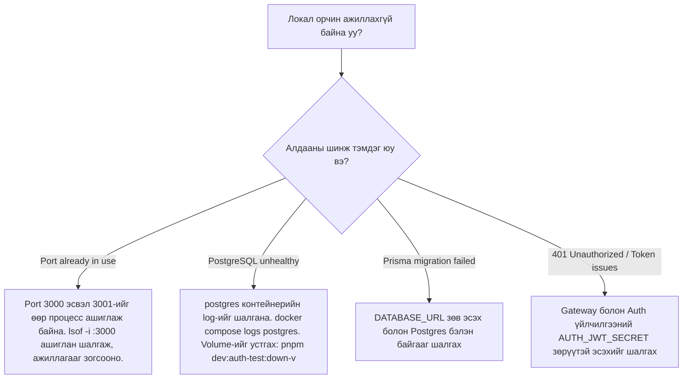

# Хөгжүүлэлтийн Зааварчилгаа: Локал Аутентификаци ба Туршилт (Local Authentication and Testing)

Энэхүү зааварчилгаа нь `seek.mn` платформын Аутентификацийн (Auth) суурь урсгал болон аюулгүй байдлын хамгаалалтуудыг локал орчинд ажиллуулах, турших, баталгаажуулах заавар юм.

---

## 1. Prerequisites (Урьдчилсан шаардлага)

Локал туршилтын орчныг ажиллуулахад дараах багажууд шаардлагатай:

- **Docker & Docker Compose** (Docker Desktop санал болгож байна)
- **Node.js** (хувилбар `>=18.0.0`)
- **pnpm** (хувилбар `>=8.0.0` эсвэл репозиторын хувилбар `9.5.0`)
- **Postman** (Collection болон Environment импортлох эсвэл Newman)

## 2. Required Software Versions (Програм хангамжийн хувилбарууд)

- Postgres: `15-alpine`
- Node.js runtime: `18-slim` / `18-alpine`
- Redis: `7-alpine`
- RabbitMQ: `3-management-alpine`

## 3. Environment Setup (Орчны хувьсагчид)

Хөгжүүлэлтийн орчныг эхлүүлэхээс өмнө орон нутгийн тохиргооны файлыг үүсгэх шаардлагатай.

POSIX (macOS / Linux):

```bash
cp .env.local.example .env.local
cp .env.example .env
```

PowerShell (Windows):

```powershell
Copy-Item .env.local.example .env.local
Copy-Item .env.example .env
```

`.env` болон `.env.local` файлууд дотор JWT секрет болон бусад хувьсагчид зөв тохируулагдсан эсэхийг баталгаажуулна уу:

- `AUTH_JWT_SECRET`: `seek_jwt_secret_key_placeholder_safe_entropy_1234567890` (Local development only)
- `AUTH_TEST_EMAIL`: `tester@seek.local`
- `AUTH_TEST_PASSWORD`: `TestPassword123!`
- `AUTH_SUPERADMIN_EMAIL`: `superadmin@lms.local`
- `AUTH_SUPERADMIN_PASSWORD`: `TestPassword123!`

## 4. Docker Compose Startup (Орчныг ажиллуулах)

Дараах тушаалаар зөвхөн аутентификацийн урсгалд шаардлагатай локал үйлчилгээнүүдийг ажиллуулна:

```bash
pnpm dev:auth-test
```

Энэхүү тушаал нь цаанаа дараах Compose тушаалыг ажиллуулж, `auth-test` профайлд хамаарах үйлчилгээнүүдийг асаана:

```bash
docker compose -f docker-compose.yml -f docker-compose.dev.yml --profile auth-test up --build
```

## 5. Migration Execution (Өгөгдлийн сангийн шилжилт)

Орчныг асаах явцад `auth-migrate` үйлчилгээ нь Postgres бэлэн болсны дараа Prisma шилжилтийг автоматаар ажиллуулдаг:

```bash
npx prisma migrate deploy
```

Энэ процесс амжилттай болсны дараа `0` кодтойгоор дуусах (exited 0) ёстой.

## 6. Seed Execution (Хөгжүүлэлтийн тест хэрэглэгч)

Шилжилт хийгдэж дууссаны дараа `auth-seed` үйлчилгээ нь `services/auth/prisma/seed.ts` файлыг ажиллуулж idempotent байдлаар dev хэрэглэгчдийг оруулах болно:

- Email: `tester@seek.local`
- Password: `TestPassword123!`
- State: `ACTIVE`
- Email: `superadmin@lms.local`
- Password: `TestPassword123!`
- State: `ACTIVE`

## 7. Expected Local URLs (Холбогдох хаягууд)

- **Portal Web**: `http://localhost:3001`
- **Gateway**: `http://localhost:3010`
- **Auth Service (Internal/Debug)**: `http://localhost:3010`
- **PostgreSQL (Local bind)**: `127.0.0.1:5432`

---

## 8. Testing Procedures (Турших заавар)

Орчин бүрэн ассаны дараа дараах тестүүдийг ажиллуулж баталгаажуулна.

### 8.1 CLI Smoke Test

Энэхүү тест нь хөтөч шаардахгүйгээр API урсгалыг дуудаж баталгаажуулна.

```bash
pnpm test:smoke:auth
```

Турших зүйлс: Gateway health, Login, `/auth/me` хандах, Token Refresh, Logout, Logout-ийн дараа дахин Refresh хийхэд 401 алдаа авах зэрэг урсгалууд.

### 8.2 Integration Test (Gateway -> Auth -> Postgres)

Jest-ээр бичигдсэн интеграци тестүүдийг ажиллуулах:

```bash
pnpm test:integration:auth
```

### 8.3 Postman Import and Run

1. `tools/postman/` хавтсаас `SEEK-Local.postman_collection.json` болон `SEEK-Local.postman_environment.json` файлуудыг Postman-д импортлох.
2. `SEEK-Local-Env` орчныг сонгох.
3. Collection доторх request-үүдийг дарааллаар ажиллуулах, эсвэл CLI-ээр `newman` ашиглан автоматжуулсан байдлаар ажиллуулах:
   ```bash
   pnpm test:postman:auth
   ```

### 8.4 Automated Browser Smoke Test (Playwright)

Playwright E2E тестийг ажиллуулж, хөтөч дээрх login, reload, logout урсгалыг шалгах:

```bash
pnpm test:e2e:auth
```

---

## 9. Troubleshooting (Түгээмэл алдаанууд ба шийдвэрлэх арга зам)



### Нарийвчилсан алдааны жагсаалт:

- **Symptom: Port already in use**
  - _Cause_: Порт 3010 эсвэл 3001-ийг арын систем ашиглаж байна.
  - _Verification command_: `lsof -i :3010` эсвэл `netstat -ano | findstr 3010` (Windows)
  - _Resolution_: Уг портыг чөлөөлөх эсвэл холбогдох процессыг зогсоох.
- **Symptom: PostgreSQL unhealthy**
  - _Cause_: Өгөгдлийн сангийн өмнөх тохиргоо зөрчилдсөн.
  - _Resolution_: Контейнерыг устгаад, volume-ийг цэвэрлэж дахин ажиллуулна:
    ```bash
    pnpm dev:auth-test:down-v
    pnpm dev:auth-test
    ```
- **Symptom: CSRF 403 Forbidden**
  - _Cause_: Буруу Origin буюу зөвшөөрөгдөөгүй Origin-оос хүсэлт явуулсан.
  - _Resolution_: `.env` файл дахь `AUTH_ALLOWED_ORIGINS` утганд тухайн хөтчийн хаяг (жишээ нь `http://localhost:3001`) байгаа эсэхийг баталгаажуулах.

---

## 10. Safe Shutdown (Аюулгүй унтраах)

Орчныг аюулгүй зогсоох болон ажиллагааг дуусгахдаа дараах тушаалыг ашиглана:

```bash
pnpm dev:auth-test:down
```

Энэ нь өгөгдлийг (volumes) устгахгүйгээр контейнеруудыг зогсооно.

> [!WARNING]
> Дараах тушаал нь локал өгөгдлийн санг бүрмөсөн цэвэрлэх (data volume-ийг устгах) тул анхааралтай хандана уу:
>
> ```bash
> pnpm dev:auth-test:down-v
> ```

---

## 11. Security Limitations (Аюулгүй байдлын хязгаарлалт)

- Локал орчинд `AUTH_COOKIE_SECURE=false` байна, учир нь локал хөгжүүлэлт `http` дээр явагддаг. Production орчинд үүнийг заавал `true` болгож ажиллуулах шаардлагатай.
- Өөрийн хувийн болон хөгжүүлэлтийн JWT нууц түлхүүрийг репозитор болон хөгжүүлэлтийн код руу хэзээ ч commit хийж болохгүй.
