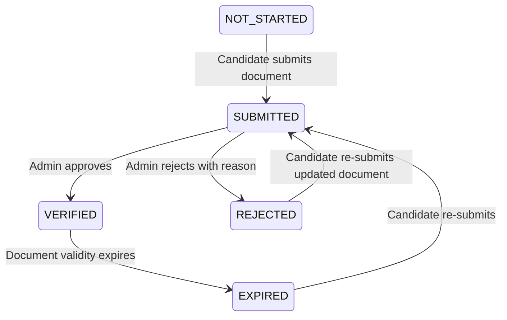

# Profile Service

Энэхүү баримт бичиг нь `Profile` үйлчилгээний дизайн, API замууд, completion policy, verification workflow болон аудитын логуудыг тайлбарлана.

## 1. API Endpoints

### Candidate (Хэрэглэгчийн) замууд
Бүх замууд нь `x-user-id` header-ийг заавал шаардана.

| API Зам | Хүсэлтийн төрөл | Тайлбар |
|:---|:---|:---|
| `/profile/me` | `GET` | Нэвтэрсэн хэрэглэгчийн профайлыг унших. |
| `/profile/me` | `PUT` | Профайл мэдээллийг шинэчлэх. (Аудит хийгдэнэ) |
| `/profile/me/completion` | `GET` | Профайлын бөглөлтийн түвшинг үнэлэх. |
| `/profile/me/assessment-gate/:id` | `GET` | Хэрэглэгч үнэлгээнд орох боломжтой эсэхийг шалгах. |
| `/profile/me/verification` | `GET` | Өөрийн баталгаажуулах хүсэлтүүдийг харах. |
| `/profile/me/verification/submit` | `POST` | Шинээр баталгаажуулах хүсэлт илгээх. (body: `{ type: string }`) |
| `/profile/me/documents` | `GET` | Бичиг баримтын метадата жагсаалтыг харах. |
| `/profile/me/documents` | `POST` | Шинэ бичиг баримтын метадата бүртгэх. |
| `/profile/me/documents/:id` | `DELETE` | Бичиг баримтын метадата устгах. |

### Admin (Админ / Хянагчийн) замууд
Бүх замууд нь `x-user-id` болон `x-user-roles` (SUPER_ADMIN, ASSESSOR гэх мэт) шаардана.

| API Зам | Хүсэлтийн төрөл | Тайлбар |
|:---|:---|:---|
| `/profile/admin/verifications` | `GET` | Бүх баталгаажуулах хүсэлтүүдийг харах. |
| `/profile/admin/verifications/:id/approve`| `POST` | Баталгаажуулах хүсэлтийг зөвшөөрөх. |
| `/profile/admin/verifications/:id/reject` | `POST` | Баталгаажуулах хүсэлтийг татгалзах. |

---

## 2. Completion Policy (Бөглөлтийн бодлого)

Хэрэглэгчийн профайл бөглөгдсөн эсэхийг `evaluateProfileCompletion` функцээр тооцоолно.

### Шаардлагатай (Required) талбарууд:
Эдгээр талбаруудыг заавал бөглөсөн байх шаардлагатай бөгөөд бөглөөгүй тохиолдолд үнэлгээний эрх хаагдана (`PROFILE_INCOMPLETE`).
1. `displayName` (Овог нэр)
2. `phoneNumber` (Утасны дугаар)
3. `country` (Амьдарч буй улс)
4. `preferredLanguage` (Сонгосон хэл)

### Санал болгох (Recommended) талбарууд:
1. `organisation` (Сургууль эсвэл Ажлын газар)
2. `birthDate` (Төрсөн он сар өдөр)
3. `address` (Хаяг)

---

## 3. Verification Workflow (Баталгаажуулалт)

Баталгаажуулалтын хүсэлт нь дараах төлөвийн шилжилтүүдийг хийнэ:

### Баталгаажуулалтын төрлүүд (Types):
- `IDENTITY` (Хувийн мэдээлэл) - Зөвшөөрөх үед `UserProfile.verifiedAt` шинэчлэгдэнэ.
- `EMPLOYMENT` (Албан тушаал)
- `ORGANISATION` (Байгууллагын харьяалал)
- `EDUCATION` (Боловсролын зэрэг)
- `ASSESSOR` (Мэргэжлийн үнэлгээ)

---

## 4. Audit Log Events

Профайл үйлчилгээний аливаа өөрчлөлтийг `ProfileAuditLog` хүснэгтэд хадгална. PII (Хувийн нууц мэдээлэл)-ийг консолын лог руу хэвлэхгүй бөгөөд зөвхөн өгөгдлийн санд immutable хэлбэрээр хадгална.

### Аудитын үйлдлүүд:
- `PROFILE_CREATED`: Шинэ профайл үүсэхэд.
- `PROFILE_UPDATED`: Профайл мэдээлэл шинэчлэгдэхэд.
- `PROFILE_COMPLETION_CHANGED`: Профайлын completion төлөв өөрчлөгдөхөд.
- `VERIFICATION_SUBMITTED`: Баталгаажуулах хүсэлт илгээхэд.
- `VERIFICATION_APPROVED`: Хүсэлтийг зөвшөөрөхөд.
- `VERIFICATION_REJECTED`: Хүсэлтийг татгалзахад.
- `DOCUMENT_ADDED`: Бичиг баримт нэмэгдэхэд.
- `DOCUMENT_REMOVED`: Бичиг баримт устгагдахад.

---

## 5. Future Integrations (Ирээдүйд хийгдэх холболтууд)

1. **OTP/SMS Provider:** Утасны дугаарыг бодитоор баталгаажуулахын тулд SMS OTP үйлчилгээ холбож `phoneNumberVerifiedAt`-ийг тохируулна.
2. **Object Storage:** Бичиг баримтуудыг бодит S3 / MinIO storage рүү хуулдаг presigned URL холболтыг хийнэ.
3. **External KYC:** Иргэний үнэмлэхийг E-Mongolia эсвэл бусад KYC системүүдтэй холбож автоматаар баталгаажуулна.
