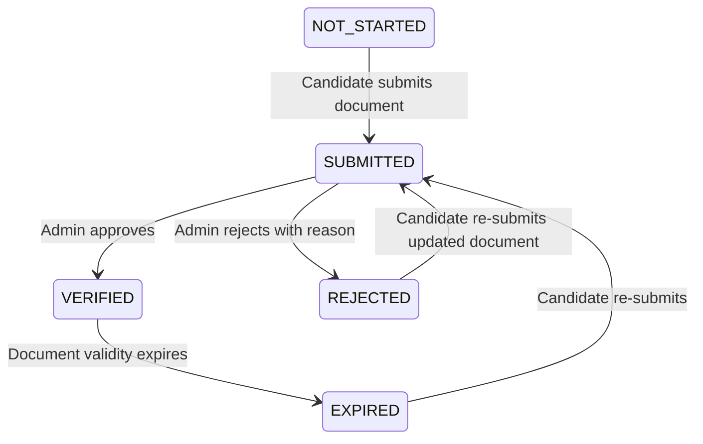

# Profile Service

Энэхүү баримт бичиг нь `Profile` үйлчилгээний дизайн, API замууд, completion policy, verification workflow болон аудитын логуудыг тайлбарлана.

## 1. API Endpoints

### Candidate (Хэрэглэгчийн) замууд
Бүх замууд нь `x-user-id` header-ийг заавал шаардана.

| API Зам | Хүсэлтийн төрөл | Тайлбар |
|:---|:---|:---|
| `/profile/me` | `GET` | Нэвтэрсэн хэрэглэгчийн профайлыг унших. |
| `/profile/me` | `PUT` | Профайл мэдээллийг шинэчлэх. (Аудит хийгдэнэ) |
| `/profile/me/completion` | `GET` | Профайлын бөглөлтийн түвшинг үнэлэх. |
| `/profile/me/assessment-gate/:id` | `GET` | Хэрэглэгч үнэлгээнд орох боломжтой эсэхийг шалгах. |
| `/profile/me/verification` | `GET` | Өөрийн баталгаажуулах хүсэлтүүдийг харах. |
| `/profile/me/verification/submit` | `POST` | Шинээр баталгаажуулах хүсэлт илгээх. (body: `{ type: string }`) |
| `/profile/me/documents` | `GET` | Бичиг баримтын метадата жагсаалтыг харах. |
| `/profile/me/documents` | `POST` | Шинэ бичиг баримтын метадата бүртгэх. |
| `/profile/me/documents/:id` | `DELETE` | Бичиг баримтын метадата устгах. |

### Admin (Админ / Хянагчийн) замууд
Бүх замууд нь `x-user-id` болон `x-user-roles` (SUPER_ADMIN, ASSESSOR гэх мэт) шаардана.

| API Зам | Хүсэлтийн төрөл | Тайлбар |
|:---|:---|:---|
| `/profile/admin/verifications` | `GET` | Бүх баталгаажуулах хүсэлтүүдийг харах. |
| `/profile/admin/verifications/:id/approve`| `POST` | Баталгаажуулах хүсэлтийг зөвшөөрөх. |
| `/profile/admin/verifications/:id/reject` | `POST` | Баталгаажуулах хүсэлтийг татгалзах. |

Portal admin UI дээр `/admin/profile` route нь verification queue-г харуулж, status filter, approve action, reject reason modal-оор ажиллана. `/superadmin/profile` нь verification operations overview болон шуурхай review queue харуулна. `/assessor/profile` нь үнэлэгчийн profile readiness, өөрийн verification/document төлөвийг харуулна.

---

## 2. Completion Policy (Бөглөлтийн бодлого)

Хэрэглэгчийн профайл бөглөгдсөн эсэхийг `evaluateProfileCompletion` функцээр тооцоолно.

Profile language, gender, verification type/status, document status зэрэг literal contract-ууд `@seek/contracts` дотор нэг эх сурвалжтай (`PROFILE_LANGUAGES`, `PROFILE_VERIFICATION_TYPES`, `PROFILE_VERIFICATION_STATUSES`, `PROFILE_DOCUMENT_STATUSES`) байна.

Completion response нь хоёр түвшинтэй:
- `basicComplete`: profile-ийн үндсэн required талбарууд бөглөгдсөн эсэх.
- `trustedComplete`: үндсэн талбарууд дээр нэмээд утас баталгаажсан эсэх.

Backward compatibility-д `isComplete` нь `trustedComplete`-тэй ижил утгатай.

### Шаардлагатай (Required) талбарууд:
Эдгээр талбаруудыг заавал бөглөсөн байх шаардлагатай бөгөөд бөглөөгүй тохиолдолд үнэлгээний эрх хаагдана (`PROFILE_INCOMPLETE`). `displayName`, `phoneNumber`, `country`, `preferredLanguage` нь `basicComplete`-д орно. `phoneNumberVerified` нэмэгдэж байж `trustedComplete` болно.
1. `displayName` (Овог нэр)
2. `phoneNumber` (Утасны дугаар)
3. `phoneNumberVerified` (`phoneNumberVerifiedAt` бөглөгдсөн байх)
4. `country` (Амьдарч буй улс)
5. `preferredLanguage` (Сонгосон хэл)

### Санал болгох (Recommended) талбарууд:
1. `organisation` (Сургууль эсвэл Ажлын газар)
2. `birthDate` (Төрсөн он сар өдөр)
3. `address` (Хаяг)

---

## 3. Verification Workflow (Баталгаажуулалт)

Баталгаажуулалтын хүсэлт нь дараах төлөвийн шилжилтүүдийг хийнэ:

### Баталгаажуулалтын төрлүүд (Types):
- `IDENTITY` (Хувийн мэдээлэл) - Зөвшөөрөх үед `UserProfile.verifiedAt` шинэчлэгдэнэ.
- `EMPLOYMENT` (Албан тушаал)
- `ORGANISATION` (Байгууллагын харьяалал)
- `EDUCATION` (Боловсролын зэрэг)
- `ASSESSOR` (Мэргэжлийн үнэлгээ)

Evidence policy:
- `IDENTITY` хүсэлтэд registry number заавал бөгөөд 2 үсэг + 8 оронтой форматтай байна.
- `EMPLOYMENT`, `ORGANISATION`, `EDUCATION`, `ASSESSOR` хүсэлтүүдэд тухайн type-ийн `UPLOADED` эсвэл `VERIFIED` document metadata байх ёстой.
- `SUBMITTED` болон `VERIFIED` төлөвтэй ижил type-ийн хүсэлт байвал duplicate submit хаагдана.
- `REJECTED` дараа evidence байгаа бол дахин submit хийх боломжтой.

## 4. Assessment Gate

`GET /profile/me/assessment-gate/:id` нь profile-owned readiness-г шалгахаас гадна caller/gateway/service adapter-аас ирсэн gate context-г нэгтгэнэ.

Supported blocked reasons:
- `EMAIL_NOT_VERIFIED` -> `VERIFY_EMAIL`
- `PROFILE_INCOMPLETE` -> `COMPLETE_PROFILE`
- `ALREADY_ATTEMPTED` -> `VIEW_RESULT`
- `ASSESSMENT_NOT_OPEN` -> `WAIT`
- `NOT_ENROLLED` -> `ENROLL`
- `PAYMENT_REQUIRED` -> `PAY`

Auth-owned email status, assessment schedule/enrollment/attempt/payment status нь profile service-ийн ownership биш. Энэ task дээр эдгээр нь query/adapter boundary хэлбэрээр орж ирнэ.

---

## 5. Audit Log Events

Профайл үйлчилгээний аливаа өөрчлөлтийг `ProfileAuditLog` хүснэгтэд хадгална. PII (Хувийн нууц мэдээлэл)-ийг консолын лог руу хэвлэхгүй бөгөөд зөвхөн өгөгдлийн санд immutable хэлбэрээр хадгална.

### Аудитын үйлдлүүд:
- `PROFILE_CREATED`: Шинэ профайл үүсэхэд.
- `PROFILE_UPDATED`: Профайл мэдээлэл шинэчлэгдэхэд.
- `PROFILE_COMPLETION_CHANGED`: Профайлын completion төлөв өөрчлөгдөхөд.
- `VERIFICATION_SUBMITTED`: Баталгаажуулах хүсэлт илгээхэд.
- `VERIFICATION_APPROVED`: Хүсэлтийг зөвшөөрөхөд.
- `VERIFICATION_REJECTED`: Хүсэлтийг татгалзахад.
- `VERIFICATION_AUTO_APPROVED`: KYC adapter автоматаар зөвшөөрөхөд.
- `VERIFICATION_AUTO_REJECTED`: KYC adapter автоматаар татгалзахад.
- `DOCUMENT_ADDED`: Бичиг баримт нэмэгдэхэд.
- `DOCUMENT_REMOVED`: Бичиг баримт устгагдахад.

---

## 6. Current Integrations (Интеграциуд)

1. **OTP/SMS Integration (SMS Адаптер):**
   - Утасны дугаар руу `/profile/me/verification/phone/send-otp` замаар 6 оронтой OTP код илгээнэ.
   - Profile service OTP-г raw хэлбэрээр application log руу хэвлэхгүй, metadata дотор hash + salt хэлбэрээр хадгална.
   - Ирсэн кодыг `/profile/me/verification/phone/verify-otp` замаар баталгаажуулж `phoneNumberVerifiedAt` утгыг системд тэмдэглэнэ.
   - OTP нь 5 минут хүчинтэй, resend cooldown 60 секунд, нэг цагийн send cap болон буруу оролдлогын lock policy-тэй.
   - `123456` dev bypass нь production-д ажиллахгүй. Зөвхөн `NODE_ENV !== "production"` болон `PROFILE_DEV_OTP_BYPASS_ENABLED=true` үед ашиглаж болно.

2. **MinIO Object Storage Integration (Файл хадгалах сан):**
   - Бичиг баримт оруулахдаа `/api/v1/file/presigned-upload` замаар MinIO-ийн Presigned PUT URL авна.
   - File service gateway-аас ирсэн `x-user-id`-г ашиглаж storage key-г `documents/{userId}/...` хэлбэрээр үүсгэнэ.
   - Хөтчөөс шууд тухайн URL-аар дамжуулан файлыг MinIO-д оруулж, метадатыг профайл үйлчилгээнд хадгална.
   - Profile service document metadata бүртгэхээс өмнө file service-ийн `/file/objects/verify` boundary-аар object байгаа эсэх, size, mime type, user-scoped storage key-г шалгана.
   - Document delete нь profile metadata-г устгаад file service-ийн `/file/objects` delete boundary-аар object-г устгана. Missing object delete нь idempotent гэж үзнэ.

3. **External KYC (Дан) Integration (Регистрийн дугаар шалгах):**
   - `IDENTITY` төрлийн баталгаажуулах хүсэлт илгээхэд гадны KYC адаптер руу хэрэглэгчийн овог, нэр болон оруулсан регистрийн дугаарыг дамжуулж автоматаар шалгана.
   - Регистрийн дугаар нь 2 үсэг + 8 оронтой форматтай байх ёстой. Буруу форматтай бол KYC adapter дуудагдахгүй.
   - Шалгалт амжилттай бол шууд `VERIFIED` болох ба амжилтгүй бол `REJECTED` болно.
