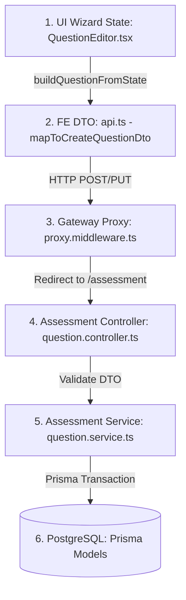

# Даалгавар (Question) өгөгдлийн урсгал болон бүтцийн заавар

Энэхүү баримт бичиг нь `seek.mn` платформд асуулт (Question) үүсгэх, засахад өгөгдөл UI-аас эхлэн өгөгдлийн сан хүртэл хэрхэн дамждаг урсгалыг харуулсан дэлгэрэнгүй заавар юм. Хөгжүүлэгч өөрөө бие даан талбар нэмэх, засах тохиолдолд энэхүү дарааллыг дагана.

---

## 1. Өгөгдлийн урсгалын ерөнхий зураглал (Data Flow Architecture)



---

## 2. Алхам алхмаар өгөгдлийн хувиргалт (Step-by-Step Data Mapping)

### Алхам 1: UI Wizard State (`QuestionEditor.tsx`)
Хэрэглэгч асуулт бэлтгэх үед утгуудыг хуудасны local React state болох `state` (төрөл: `QuestionWizardState`)-д хадгална.
- **Байршил:** [QuestionEditor.tsx](file:///home/bd/seek-v1/apps/portal-web/src/features/assessor-workspace/QuestionEditor.tsx)
- **Гол талбарууд:**
  - `code`: Асуултын цор ганц код (жишээ нь: `MATH-01`)
  - `title`: Асуултын гарчиг
  - `stem`: Асуултын их бие (Markdown / KaTeX)
  - `type`: Асуултын төрөл (`QuestionType` enum)
  - `options`: Хариултын сонголтууд (Сонголтын текст, зөв эсэх, оноо г.м)
  - `media`: Хавсралт файлуудын мэдээлэл

### Алхам 2: Frontend DTO бэлтгэх ба HTTP хүсэлт илгээх (`api.ts`)
Хадгалах эсвэл илгээх товч дарахад State-ийг backend-ийн хүлээж авах dto хэлбэрт шилжүүлнэ.
- **Байршил:** [api.ts](file:///home/bd/seek-v1/apps/portal-web/src/features/assessor-workspace/api.ts)
- **Функцүүд:**
  1. `buildQuestionFromState(state, sourceQuestion)`: UI state-ийг `QuestionBankItem` формат руу хөрвүүлнэ.
  2. `mapToCreateQuestionDto(data)`: `QuestionBankItem`-ийг API-ийн хүлээж авах `CreateQuestionDto` бүтцэд оруулна. Сонголтуудыг `payload.options` руу, хавсралтыг `media` руу тус тус бэлтгэнэ.
  3. `createQuestion(data)` / `updateQuestion(id, data)`: `requestAssessmentJson` ашиглан `/api/v1/assessment/questions` линк рүү хүсэлт шиднэ.

### Алхам 3: Gateway Proxy чиглүүлэлт (`proxy.middleware.ts`)
Нүүрэн талын хүсэлт эхлээд `gateway` сервис дээр ирнэ.
- **Байршил:** [proxy.middleware.ts](file:///home/bd/seek-v1/services/gateway/src/proxy.middleware.ts)
- **Ажиллагаа:**
  - `/api/v1/assessment/questions` хүсэлтийг таниад `Host` болон JWT баталгаажуулалт хийнэ.
  - Уг хүсэлтийг `/assessment/questions` болгон хувиргаж `ASSESSMENT_SERVICE_URL` (порт: `3070`) руу дамжуулна (Reverse Proxy).

### Алхам 4: API Controller ба NestJS DTO (`question.controller.ts`)
`assessment` микросервис дээр хүсэлт ирнэ.
- **Байршил:** [question.controller.ts](file:///home/bd/seek-v1/services/assessment/src/question.controller.ts) болон [question.dto.ts](file:///home/bd/seek-v1/services/assessment/src/dto/question.dto.ts)
- **Ажиллагаа:**
  - `@Post()` болон `@Put(":id")` чиглүүлэгчид хүсэлтийн body-г `CreateQuestionDto` / `UpdateQuestionDto` ашиглан хүлээн авч баталгаажуулна.

### Алхам 5: Түүхэн хувилбарт суурилсан Transaction үүсгэх (`question.service.ts`)
Өгөгдлийг бааз руу бичих үндсэн логик ажиллана. Энд асуултыг шууд засахгүйгээр хувилбар (Version) үүсгэж хадгалдаг.
- **Байршил:** [question.service.ts](file:///home/bd/seek-v1/services/assessment/src/question.service.ts)
- **Үе шат:**
  1. `Question` (Эх контейнер) рекордыг шалгаж үүсгэнэ/шинэчилнэ.
  2. `QuestionVersion` (Тухайн хувилбар) рекордыг шинээр (хувилбар + 1) эсвэл `DRAFT` төлөвтэй бол өмнөх хувилбарыг дарж бичнэ.
  3. Сонголтуудыг `QuestionOptionVersion` хүснэгтэд тус тусад нь бичнэ.
  4. Медиа хавсралтуудыг `QuestionMedia` хүснэгтэд бичнэ.

### Алхам 6: Өгөгдлийн сангийн загварчлал (`schema.prisma`)
Prisma ORM-оор дамжуулан PostgreSQL-ийн дараах хүснэгтүүдэд өгөгдөл хадгалагдана.
- **Байршил:** [schema.prisma](file:///home/bd/seek-v1/services/assessment/prisma/schema.prisma)
- **Хүснэгтүүд (Models):**
  - `model Question`: Асуултын ерөнхий мэдээлэл (Код, идэвхтэй төлөв, үүсгэсэн хэрэглэгч г.м).
  - `model QuestionVersion`: Асуултын тодорхой хувилбар (Их бие, Төрөл, Хугацаа, Хамгийн их оноо, Заавар тайлбар, Рубрик, Нэмэлт тохиргооны JSON талбарууд).
  - `model QuestionOptionVersion`: Тухайн хувилбарт хамаарах хариултын сонголтууд (Сонголтын түлхүүр, Утга, Зөв эсэх, Оноо, Сөрөг оноо).
  - `model QuestionMedia`: Тухайн хувилбарт хамаарах хавсралт медиа файлууд (Storage key, File type, Хэмжээ).

---

## 3. Өөрийн гараар талбар нэмэх, засах удирдамж (How to customize)

Хэрэв та асуултад шинээр нэг талбар (жишээ нь: `difficultyRating` эсвэл нэмэлт тохиргоо) оруулах шаардлагатай бол дараах дарааллаар кодыг засна:

### 1. Prisma загвар шинэчлэх ба Migration ажиллуулах
1. [schema.prisma](file:///home/bd/seek-v1/services/assessment/prisma/schema.prisma) файл руу орж холбогдох модель дээр талбараа нэмнэ.
   *(Жишээ: `QuestionVersion` модель дээр `difficultyRating Int?` нэмэх)*
2. Дараах тушаалаар баазын схемээ шинэчилж migration үүсгэнэ:
   ```bash
   pnpm --prefix services/assessment prisma migrate dev --name add_difficulty_rating
   ```

### 2. Backend DTO болон Service-ийг шинэчлэх
1. [question.dto.ts](file:///home/bd/seek-v1/services/assessment/src/dto/question.dto.ts) доторх `CreateQuestionDto` болон `UpdateQuestionDto` ангиудад талбараа нэмнэ.
2. [question.service.ts](file:///home/bd/seek-v1/services/assessment/src/question.service.ts) доторх `create` болон `update` үйлдлүүдэд бааз руу бичих хэсэгт шинэ талбараа дамжуулж оруулна.

### 3. Frontend API Mapper болон Types шинэчлэх
1. [types.ts](file:///home/bd/seek-v1/apps/portal-web/src/features/assessor-workspace/types.ts) файлын `QuestionBankItem` болон `QuestionWizardState` бүтцэд шинэ талбарын төрлийг нэмж өгнө.
2. [api.ts](file:///home/bd/seek-v1/apps/portal-web/src/features/assessor-workspace/api.ts) доторх:
   - `mapToCreateQuestionDto`: Бааз руу явуулахын өмнө шинэ талбарыг DTO-д оноож өгнө.
   - `mapVersionToQuestionBankItem`: Баазаас ирсэн өгөгдлийг UI-д ашиглахад зориулж хөрвүүлнэ.

### 4. UI болон Харагдах байдалд тусгах
1. [QuestionEditor.tsx](file:///home/bd/seek-v1/apps/portal-web/src/features/assessor-workspace/QuestionEditor.tsx) дотор тухайн талбарыг хэрэглэгч оруулах Input эсвэл Select элементийг нэмж, `setState` ашиглан state-ийг шинэчилнэ.
2. [QuestionPreviewModal.tsx](file:///home/bd/seek-v1/apps/portal-web/src/features/assessor-workspace/QuestionPreviewModal.tsx) цонхонд шинэ талбарын утгыг харуулж урьдчилан харна.

---

## 4. Баталгаажуулах алхам (Verification)

Өөрчлөлтийг оруулсны дараа дараах тушаалуудаар кодын бүрэн бүтэн байдлыг заавал шалгана:

- **TypeScript-ийн алдаа байгаа эсэхийг шалгах:**
  ```bash
  npx --prefix apps/portal-web tsc --noEmit
  ```
- **Сервисүүдийг дахин угсарч ажиллуулах:**
  ```bash
  docker compose up -d --build assessment portal-web
  ```
- **Лог шалгах:**
  ```bash
  docker compose logs -f assessment
  ```

---

## 5. QuestionEditor.tsx-ийн функцүүдийн үүрэг ба Асуултын төрөл бүрийг өөрчлөх удирдамж

[QuestionEditor.tsx](file:///home/bd/seek-v1/apps/portal-web/src/features/assessor-workspace/QuestionEditor.tsx) нь асуулт үүсгэх, засахад хэрэглэгддэг 3 шатлалтай Wizard хуудас юм.

### 5.1. Үндсэн функцүүд болон тэдгээрийн үүрэг

1. **Төлөв (State) ба анхны утга оноох логик:**
   - `buildInitialState(mode, question)`: Засах эсвэл шинээр үүсгэх горимоос хамаарч асуултын эхний утгуудыг React-ийн үндсэн `state`-д онооно.
   - `setPartial(patch)`: `state`-ийн зөвхөн тодорхой хэсэг талбаруудыг шинэчлэхэд хэрэглэгдэх хурдан туслах функц.
   - `buildQuestionFromState(state, source)`: Одоогийн хуудсан дээрх state-ийн өгөгдлийг бааз руу илгээх эсвэл Preview цонхонд үзүүлэхэд зориулан `QuestionBankItem` бүтцэд хөрвүүлнэ.

2. **Оноо тооцоолох динамик логик (`useEffect`):**
   - Даалгаврын сонголтууд (`state.options`), төрөл (`state.type`), рубрик эсвэл үнэлэх горим өөрчлөгдөх бүрт ажиллана.
   - Асуултын төрлөөс хамаарч авах боломжтой хамгийн их оноо (`totalPoints`) болон хамгийн бага оноог (`correctPoints`) автоматаар тооцоолж үндсэн state-д хадгална.

3. **Баталгаажуулалт ба хадгалалт:**
   - `validateWizard(state)`: Хадгалахын өмнө бүх чанарын checklist (гарчиг, өгүүлбэр, зөв хариулт, оноо) бүрэн бөглөгдсөн эсэхийг шалгана.
   - `saveDraft()`: Одоогийн өөрчлөлтийг `ACTIVE` төлөвтэй боловч Ноорог (Draft) хувилбар хэлбэрээр баазад хадгална.
   - `requestApproval()`: Бүх checklist биелсэн бол чанарын баталгаажуулалт руу илгээнэ (`approval_requested` эсвэл `resubmitted`).

4. **Интерактив үйлдэл:**
   - `preview()`: Хадгалаагүй байгаа өөрчлөлтийг урьдчилан харах модал цонх (`QuestionPreviewModal`) руу дамжуулж нээнэ.

---

### 5.2. Асуултын төрлүүдийг өөрчлөх, загварчилж засах удирдамж

Асуултыг үүсгэх эхний шатанд (`step === 1`), асуултын төрлөөс хамааран өөр өөр тусгай дэд компонентууд ачаалагддаг. Загвар болон өгөгдөл олголтыг өөрчлөхийн тулд дараах компонентуудтай ажиллана:

#### 1. Нэг сонголттой (`SINGLE_CHOICE`) ба Үнэн/Худал (`TRUE_FALSE`) асуулт
- **Хэрэглэгдэх компонент:** `SingleChoiceOptions`
- **Ажиллах функцүүд:**
  - `updateOption(index, patch)`: Сонголтын текст, зөв эсэх, болон тухайн сонголтод зориулсан эерэг/сөрөг оноог шинэчилнэ.
  - `addOption()`, `removeOption(index)`: Шинээр сонголт нэмэх болон хасах.
- **Өөрчлөх удирдамж:** Хэрэв сонгох радио товчны дизайн, хүрээний өнгийг өөрчлөх бол `SingleChoiceOptions` доторх JSX-ийг засч өөрчилнө.

#### 2. Олон сонголттой асуулт (`MULTIPLE_CHOICE`)
- **Хэрэглэгдэх компонент:** `MultipleChoiceOptions`
- **Ажиллах функцүүд:**
  - `updateOption(index, patch)`: Олон зөв хариулттай байж болох тул сонголт бүрийн `isCorrect` checkbox-ийг өөрчлөх болон оноог удирдана.
- **Өөрчлөх удирдамж:** Нэгээс олон хариулт сонгох үеийн шалгах checkbox-ийн харагдах байдал, оноо тус бүрийн баджийг `MultipleChoiceOptions` дотор засч тохируулна.

#### 3. Хоосон зай бөглөх асуулт (`FILL_BLANK`)
- **Хэрэглэгдэх компонент:** `FillInBlankOptions`
- **Ажиллах функцүүд:**
  - `updateOption(index, { acceptedValues: [...] })`: Нэг даалгаварт олон хоосон зай (`{{blank_1}}`, `[[1]]`) байж болох ба хоосон зай бүрд зөвшөөрөгдөх хувилбаруудыг оноож өгдөг.
- **Өөрчлөх удирдамж:** Хоосон зайд оруулах хувилбар нэмэх товч, том/жижиг үсэг ялгах (caseSensitive) checkbox-ийн зохиомж, онооны хуваарилалтын UI-г `FillInBlankOptions` дотор өөрчилнө.

#### 4. Тохирохыг олох асуулт (`MATCHING`)
- **Хэрэглэгдэх компонент:** `MatchingOptions`
- **Ажиллах функцүүд:**
  - `updateOption(index, { value: "Зүүн тал", matchValue: "Баруун тал" })`: Зүүн талын асуулт, түүнд тохирох баруун талын зөв хариултын хосыг хадгална.
- **Өөрчлөх удирдамж:** Зүүн болон баруун багануудын өнгө загвар, чирэх-байршуулах (drag & drop) чиглүүлэгч дизайныг `MatchingOptions` компонент дотор өөрчилж тохируулна.

#### 5. Тоон утга оруулах асуулт (`NUMERIC`)
- **Хэрэглэгдэх компонент:** `NumericOptions`
- **Ажиллах функцүүд:**
  - `updateOption(0, { value: "Тоо", matchValue: "Хүлцэх алдааны утга" })`: Зөв тоон хариулт болон зөвшөөрөгдөх алдааны хэлбэлзлийг хадгална.
- **Өөрчлөх удирдамж:** Тоон утга оруулдаг input талбар, алдааны хязгаарыг удирдах хэсгийн харагдах байдлыг `NumericOptions` дотор өөрчилнө.

#### 6. Эссэ болон Бичгийн даалгавар (`ESSAY`)
- **Хэрэглэгдэх компонент:** `EssayOptions` болон `StepTwo` дахь Rubric удирдлагууд
- **Ажиллах функцүүд:**
  - `state.rubric` утгыг шууд шинэчилж, үнэлгээ хийх шалгуурууд (шалгуурын нэр, дээд оноо г.м) бүхий хүснэгтийг удирдана.
- **Өөрчлөх удирдамж:** Рубрик үнэлгээний хүснэгт, шалгуур үзүүлэлт нэмж хасдаг хэсгийн загвар, оноо олголт тохируулах UI-г `EssayOptions` болон `StepTwo` хэсэгт өөрчилнө.

---

## 6. Өгөгдлийн сан (Database Schema) ба UI/Frontend талбаруудын нийцлийн шинжилгээ

Асуултын өгөгдлийн урсгалыг ойлгомжтой байлгах, засах болон хөгжүүлэхэд төөрөгдөл үүсгэхгүй байх зорилгоор өгөгдлийн бааз дахь талбаруудыг "Source of Truth" (Үнэн бодит эх сурвалж) гэж үзэн, UI/Frontend дээрх талбаруудын нэрийг ижилсүүлж нийцүүлэх шинжилгээг доор харуулав.

### 6.1. Өгөгдлийн бааз ба UI/Frontend талбаруудын зөрүүтэй байдал (Discrepancy Analysis)

| Хүснэгт (Prisma Model) | Баазын талбар (Source of Truth) | UI / Frontend талбар (Одоо байгаа) | Санал болгож буй өөрчлөлт (UI-г баазад нийцүүлэх) |
| :--- | :--- | :--- | :--- |
| `QuestionVersion` | `body` | `stem` / `body` | UI дээр асуултын их биеийг заасан `stem` хувьсагчийн нэрийг бүрэн `body` болгон шинэчлэх. |
| `QuestionVersion` | `defaultTimeSeconds` | `durationSeconds` | UI болон Wizard State дээрх `durationSeconds`-ийг `defaultTimeSeconds` болгох. |
| `QuestionVersion` | `defaultMaxScore` | `points` / `totalPoints` | UI болон Wizard State дээрх `points`, `totalPoints`-ийг `defaultMaxScore` болгох. |
| `QuestionVersion` | `defaultMinScore` | `minPoints` / `correctPoints` | UI болон Wizard State дээрх `minPoints`, `correctPoints`-ийг `defaultMinScore` болгох. |
| `QuestionVersion` | `explanation`, `feedbackCorrect`, `feedbackIncorrect` | `feedback`, `feedbackCorrect`, `feedbackIncorrect` | Ерөнхий тайлбарт `explanation` талбарыг, зөв/буруу хариултын тайлбарт `feedbackCorrect`/`feedbackIncorrect`-ийг ашиглаж хэвээр үлдээх. |
| `QuestionVersion` | `versionStatus` | `status` | `QuestionBankItem`-д `versionStatus` (жишээ нь: `draft` -> `DRAFT`) талбарыг баазын загвартай ижил uppercase болгон хэрэглэх. |
| `QuestionOptionVersion` | `value` | `content` | Хариултын сонголтын текстийг заасан `content`-ийг `value` болгож өөрчлөх. |
| `QuestionOptionVersion` | `optionKey` | `id` / `label` | Сонголтын цор ганц түлхүүрийг заахын тулд `id`-ийг `optionKey` болгон ашиглах. |
| `QuestionMedia` | `mediaType` | `type` | Хавсралт файлын төрлийг (`type: "image"`) баазын `mediaType` ("IMAGE")-тай ижилсүүлэх. |

---

### 6.2. UI талбаруудыг баазын схемтэй нийцүүлэх хэрэгжүүлэлтийн төлөвлөгөө (Alignment Implementation Plan)

Баазын бүтцэд өөрчлөлт оруулахгүйгээр (баазын өгөгдлийг хэвээр хадгалахын тулд), нүүрэн талын (`portal-web`) дараах хэсгүүдэд талбарын нэршлийг өөрчилж ижилсүүлнэ:

#### 1-р алхам: Frontend Төрлүүдийг шинэчлэх ([`types.ts`](file:///home/bd/seek-v1/apps/portal-web/src/features/assessor-workspace/types.ts))
- `QuestionOption` интерфэйсийг шинэчлэх:
  - `content` -> `value` болгох.
  - `id` -> `optionKey` болгож өөрчлөх.
- `QuestionBankItem` интерфэйсийг шинэчлэх:
  - `stem` талбарыг хасах.
  - `points` болон `defaultMaxScore`-ийг нэгтгэж `defaultMaxScore` болгох.
  - `minPoints` болон `defaultMinScore`-ийг нэгтгэж `defaultMinScore` болгох.
  - `durationSeconds`-ийг `defaultTimeSeconds` болгох.
  - `feedback` талбарыг `explanation` болгох.

#### 2-р алхам: API Mapper-ийг шинэчлэх ([`api.ts`](file:///home/bd/seek-v1/apps/portal-web/src/features/assessor-workspace/api.ts))
- `mapVersionToQuestionBankItem` болон `mapToCreateQuestionDto` функцүүдэд хийгдэж байгаа талбарын хөрвүүлэлтүүдийг (жишээ нь: `body: data.stem`, `defaultMaxScore: data.points`) хасч, баазын талбаруудыг шууд UI руу mapper-гүйгээр ижил нэрээр дамжуулдаг болгох.

#### 3-р алхам: Wizard State ба UI Компонентуудыг өөрчлөх ([`QuestionEditor.tsx`](file:///home/bd/seek-v1/apps/portal-web/src/features/assessor-workspace/QuestionEditor.tsx))
- `QuestionWizardState` бүтцийг шинэчлэн хуучин талбаруудыг баазынхтай ижилсүүлнэ:
  - `stem` -> `body`
  - `durationSeconds` -> `defaultTimeSeconds`
  - `totalPoints` -> `defaultMaxScore`
  - `correctPoints` -> `defaultMinScore`
  - `feedbackCorrect` -> `explanation` (эсвэл `feedbackCorrect` / `explanation` тусад нь үлдээх).
- `QuestionEditor.tsx` хуудасны бүх input-үүдийн `onChange` болон `value` талбаруудыг шинэ талбараар солих.
- `StepOne` дээрх бүх дэд асуултын төрлийн builder-үүд (жишээ нь: `SingleChoiceOptions` дахь `option.content` -> `option.value`) шинэчлэгдэнэ.

#### 4-р алхам: Урьдчилан харах модалыг шинэчлэх ([`QuestionPreviewModal.tsx`](file:///home/bd/seek-v1/apps/portal-web/src/features/assessor-workspace/QuestionPreviewModal.tsx))
- `activeQuestion.stem` -> `activeQuestion.body` болгож render хийх.
- `activeQuestion.points` -> `activeQuestion.defaultMaxScore` болгож харуулах г.м өөрчлөлтүүдийг оруулах.

---

### 6.3. Шилжилтийн үеийн эрсдэлийн удирдлага
Нэршлийг ижилсүүлснээр хөгжүүлэгчид өгөгдлийн загварыг уншихад маш хялбар болох боловч өөрчлөлт орох файлын хэмжээ их тул TypeScript typecheck-ийг `npx tsc --noEmit` ашиглан алхам бүрт нягталж, хуучин нэршил үлдээгүй эсэхийг баталгаажуулах хэрэгтэй.

