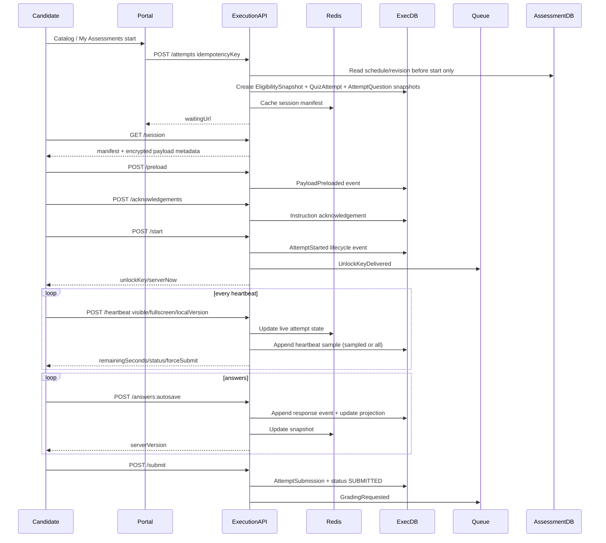

# Active Task

Status: `COMPLETED`

# Enterprise Assessment Runtime Schema And Flow Hardening

## Completion Summary

- Added enterprise Prisma schema coverage for assessment, execution, and reporting services.
- Added PostgreSQL migration addenda for runtime audit/event tables, reporting dimensions, workflow/result tables, and high-write indexes.
- Implemented runtime API aliases for session, preload, acknowledgements, start, heartbeat, autosave, navigation, violations, submit, receipt, and audit.
- Added in-memory/Redis audit event persistence for lifecycle, heartbeat, preload, acknowledgement, navigation, autosave, violation, lock, recovery, and submission receipt flows.
- Added assessment workflow endpoints for question, blueprint, quiz, and schedule publication.
- Added reporting projector endpoints for finalized assessment result to attempt fact read model.
- Validated Prisma schemas, TypeScript typecheck, and unit tests for touched services.

# Original Review

# Executive Summary

Энэ review нь `docs/ERD/assessment_db.prisma`, `docs/ERD/execution_db.prisma`, `apps/assessment-web` runtime mock, `apps/portal-web` assessor/candidate mock дээр үндэслэв.

Одоогийн дизайн зөв чиглэлтэй: configuration ба runtime database тусгаарласан, question/quiz revision versioning хийсэн, execution талд eligibility snapshot, attempt question snapshot, response event, submission idempotency, outbox байгаа. Гэхдээ enterprise production, үндэсний хэмжээний 100,000-200,000 concurrent шалгалтын шаардлагад одоогийн schema дангаараа хангалтгүй.

Гол асуудал:

- Execution DB нь runtime independence-ийн санааг зөв барьсан ч partitioning, shard key, heartbeat history, session/device integrity, lock/resume state, queue backpressure, attempt-level immutable lifecycle event log дутуу.
- Frontend runtime-д байгаа workflow-уудын нотолгоо database-д бүрэн үлдэхгүй: instruction acknowledgement, preload receipt, unlock delivery, fullscreen state, navigation, save-before-next failure, offline pending submit, reconnect attempts, client clock skew, latency.
- Assessment DB нь domain-rich боловч approval/audit/import/export/multi-tenant/access-control/reporting dimension талууд enterprise түвшинд бүрэн биш. Localization буюу translation table энэ үе шатанд шаардлагагүй; харин question/quiz бүрийн үндсэн `languageCode`-г хадгалах нь хангалттай.
- Result/reporting хэсэг сайн эхлэлтэй боловч аймаг/дүүрэг/сургууль/анги/багш/байгууллага/assessment context/time cohort-аар high-volume тайлан гаргах normalized эсвэл denormalized read model байхгүй.
- Prisma schema нь logical references ихтэй тул microservice boundary-д тохиромжтой ч integrity, contract versioning, ownership, event reconciliation механизмуудыг илүү тод болгох шаардлагатай.

# Architecture Score

| Area | Score /10 | Үндэслэл |
|---|---:|---|
| Database Design | 7.0 | Versioning, snapshots, grading/result model сайн. Гэхдээ audit, tenancy, workflow comments, field completeness дутуу. |
| Scalability | 5.5 | Execution DB тусдаа байгаа нь зөв боловч partitioning/sharding/read path/cache/backpressure/append-only event scale бүрэн шийдээгүй. |
| Security | 5.0 | Idempotency, encrypted grading payload байгаа. Харин replay/tamper/device binding/immutable audit/proctoring proof сул. |
| Maintainability | 6.5 | Model naming ойлгомжтой. Гэвч JSON policy хэт их, enum/string mismatch, cross-service references-д contract governance хэрэгтэй. |
| Frontend Compatibility | 6.0 | Runtime үндсэн endpoints таарч байна. Assessor workflow, result policy, catalog/payment/profile хэсэг schema-тай бүрэн mapped биш. |
| Performance | 5.5 | Index эхлэл бий. Гэхдээ 100k+ attempt writes-д partition, partial index, hot-row avoidance, Redis/Kafka pipeline шаардлагатай. |
| Extensibility | 7.0 | Framework/topic/competence абстракц сайн. Adaptive engine, organization hierarchy, report marts нэмэх зайтай. Translation table энэ release-д хэрэггүй. |

# High Priority Issues

## P0

1. `execution_db` дээр partition/shard strategy алга. `QuestionResponseEvent`, `QuestionResponse`, `QuizViolation`, `AttemptSubmission`, `OutboxEvent` нь 100k concurrent үед write hotspot болно.
2. Attempt lifecycle append-only event log алга. `QuizAttempt.status` шинэчлэгдэх боловч state transition-ийн immutable proof байхгүй.
3. Heartbeat history байхгүй. Зөвхөн `lastHeartbeatAt` хадгалах нь cheating/security/network SLA маргаанд хангалтгүй.
4. Replay/tamper protection бүрэн биш. Request signature, nonce, payload hash, client key id, device fingerprint hash, token binding дутуу.
5. Reporting read model байхгүй. Result table-ууд single attempt-д сайн боловч national aggregate тайлан гаргах fact/dimension model алга.

## P1

1. Frontend waiting room-ийн instruction confirmation, preload, unlock receipt schema-д тусдаа event болж хадгалагдахгүй.
2. `QuizSchedule` дээр late join, grace period, waiting room, capacity admission, resume/pause policy тусдаа field биш `operationalPolicyOverride Json` дотор бүдгэрсэн.
3. Approval workflow зөвхөн enum status түвшинд байна. `QuestionWorkflowEvent`, `QuizRevisionApproval`, `BlueprintApproval` маягийн comment/action/history model алга.
4. `AssessmentContext` нь curriculum/subject/occupation/organizationType-г string id-аар л барьсан. Reporting ба governance-д reference snapshot хэрэгтэй.
5. Payment frontend байгаа ч assessment schema-д payment policy partial, order/invoice/payment transaction/refund entitlement байхгүй.

## P2

1. Soft delete тогтмол биш: зарим model `archivedAt`-тай, олон lookup table `isActive`-тай, олон transactional table soft delete-гүй.
2. OutboxEvent status string байна; enum, locking, dedupe key, partition key, trace id, next retry policy дутуу.
3. Prisma Decimal ашигласан нь зөв боловч scoring scale/rounding policy table биш JSON-д байна.
4. `languageCode`-г question/quiz/schedule түвшинд тодорхой хадгалах хэрэгтэй. Translation table хэрэггүй, нэг item нэг хэлээр authoring хийгдэнэ.

# assessment_db Review

## Question

Зөв: bank-level entity ба current published version pointer байгаа нь зөв. `code`, owner, lifecycle status байна.

Дутуу талбарууд:

- `tenantId`: multi-tenant/read replica/security boundary-д зайлшгүй.
- `updatedBy`, `deletedAt`, `deletedBy`, `deleteReason`: soft delete ба accountability.
- `sourceType`, `sourceImportId`: import/export болон external item bank sync.
- `visibilityScope`, `accessPolicyId`: байгууллага хооронд item sharing.
- `version`: optimistic locking.
- `qualityStatus`, `usageCountSnapshot`, `exposureCountSnapshot`: question reuse, leakage risk, adaptive selection.

## QuestionType

Зөв: type catalog тусдаа.

Дутуу:

- `schemaVersion`, `answerSchema`, `renderSchema`, `gradingSchema`: frontend editor/runtime validation-д хэрэгтэй.
- `supportsAutoGrading`, `supportsManualGrading`, `supportsPartialCredit`.
- `languageAgnostic` flag эсвэл `defaultLanguageCode` optional байж болно. Translation relation энэ үе шатанд хэрэггүй.

## QuestionVersion

Зөв: immutable version model, payload/answerConfig/presentationConfig тусдаа, review/publish timestamps байна.

Дутуу:

- `updatedBy`, `updatedAt`: draft засварын мөр хэрэгтэй.
- `languageCode`: тухайн question version монгол эсвэл англи хэл дээр бичигдсэнийг ялгана. `translationGroupId` болон translation table энэ release-д хэрэггүй.
- `rubric`, `scoringConfig`, `negativeMarkingConfig`, `partialCreditPolicy`: frontend result-д negative marks/rubric/solution харагдаж байна.
- `securityClassification`, `exposurePolicy`, `confidentialUntil`.
- `checksum`, `contentHash`, `answerKeyHash`: publication integrity ба execution snapshot verification.
- `reviewComment`, `changeRequestReason`: frontend workflow history-д хэрэгтэй.

## QuestionOptionVersion

Зөв: option version immutable, key/order unique.

Дутуу:

- `contentJson`, `contentHtml`, `mediaRefs`: frontend rich editor option content.
- `isCorrect` frontend mock дээр байгаа боловч production-д browser рүү илгээхгүй; encrypted/private answer config-д байх ёстой.
- `score`, `negativeScore`, `feedback`: partial credit.
- `languageCode` нь parent `QuestionVersion`-оос уламжлагдана; option-level translation table хэрэггүй.

## QuestionMedia

Зөв: media table байна.

Дутуу:

- `fileId`, `cdnUrl`, `checksum`, `sizeBytes`, `durationMs`, `width`, `height`.
- `transcodingStatus`, `accessPolicy`, `signedUrlPolicy`.
- `languageCode`, `copyrightOwner`, `license`.

## AudienceType / AudienceLevel

Зөв: target audience hierarchy.

Дутуу:

- `tenantId`, `effectiveFrom/effectiveTo`.
- `externalCode`: ministry/education registry integration.
- `levelKind`: grade/class/rank/job-level ялгах.

## DifficultyScale / DifficultyLevel

Зөв: scale abstraction.

Дутуу:

- `numericValue`, `minAbility`, `maxAbility`: psychometrics/adaptive assessment.
- `color`, `reportOrder`.

## CognitiveFramework / CognitiveLevel

Зөв: Bloom гэх мэт framework дэмжинэ.

Дутуу:

- `frameworkVersion`, `reportBucket`.
- `parentId`: hierarchical cognitive taxonomy хэрэгтэй байж болно.

## CompetenceFramework / CompetenceType

Зөв: versioned competence framework ба tree байна.

Дутуу:

- `tenantId`, `jurisdiction`, `ownerOrganizationId`.
- `proficiencyScaleId`: competence result-д proficiency level code байгаа ч scale table алга.
- `externalStandardRef`.

## AssessmentContext

Зөв: audience, difficulty, cognitive, competence framework-үүдийг нэг context болгож холбосон.

Дутуу:

- `assessmentType`: competency/teacher/civil-service/certification/practice/mock ялгах үндсэн enum.
- `jurisdictionLevel`, `regionId`, `educationLevel`, `gradeLevel`, `subjectCode` normalized snapshot.
- `tenantId`, `ownerOrganizationId`, `languagePolicy`.
- `reportingDimensionSetId`: aggregate reporting-д context-ийг тогтвортой dimension болгоно.

## Topic

Зөв: topic tree байна.

Дутуу:

- `tenantId`, `assessmentContextId` эсвэл `taxonomyId`: одоогоор global code unique тул өөр context-д code collision гарна.
- `path`, `depth`, `orderIndex`: tree query performance.
- `externalCode`, `validFrom/validTo`, `path`, `depth`, `orderIndex`.

## TopicQuestionClassification

Зөв: question-topic-context-difficulty-cognitive link enterprise assessment-д хэрэгтэй.

Дутуу:

- `confidence`, `classifierType`, `evidence`, `reviewComment`.
- `version`: optimistic lock.
- `validityStatusReason`.
- Unique key `topicId, questionId, assessmentContextId` нь question version өөрчлөгдөхөд historical classification-д саад болно. `validatedQuestionVersionId`-г unique-д оруулах эсвэл classification revision table хэрэгтэй.

## TopicQuestionCompetence

Зөв: many-to-many weighted competence.

Дутуу:

- `contributionRule`, `minEvidenceRequired`, `reportingWeight`.
- `createdBy`, `reviewedBy`.

## QuizTemplate

Зөв: blueprint/template role-той.

Дутуу:

- Frontend `Blueprint.status=ready`-тай таарах `READY` status алга.
- `approvalWorkflowId`, `reviewComment`, `publishedBy/publishedAt`.
- `totalQuestionCount`, `totalMaxScore` snapshot.
- `blueprintType`, `assessmentType`, `version`.
- `negativeMarkingPolicy`, `sectionShufflePolicy`.

## QuizSection

Зөв: fixed/rule/adaptive, selection strategy, topic/difficulty.

Дутуу:

- Frontend blueprint дээр `durationMinutes` per section байна; энд зөвхөн per-question time limit байна.
- `poolMinSize`, `poolMaxSize`, `mandatoryCount`, `excludedCount`.
- `competenceWeights`, `cognitiveWeights`, `topicWeights`.
- `adaptiveConfig`, `leastUsedWindowDays`.
- `allowBackNavigation`, `requireSequential`.

## SectionQuestion

Зөв: pinned/latest version, overrides.

Дутуу:

- Frontend `mandatory/excluded/none` override-д зориулсан `selectionRole`.
- `weight`, `negativeScoreOverride`, `timeLimitOverride`.
- `reason`, `createdBy`.

## Quiz

Зөв: published revision pointer.

Дутуу:

- `tenantId`, `ownerOrganizationId`.
- `updatedBy`, `version`.
- `visibilityStatus`, `catalogStatus`.
- `assessmentType`, `languageCode`.

## QuizRevision

Зөв: immutable published revision, runtime/proctoring/result policy snapshots.

Дутуу:

- `totalQuestionCount`, `totalMaxScore`, `questionManifestHash`.
- `leaderboardPolicy`, `solutionVisibilityPolicy` fields эсвэл strongly typed policy table. Frontend: hideSolutions/showLeaderboard/showScore/showCorrectness/showCorrectAnswers/showExplanations.
- `negativeMarkingPolicy`, `roundingPolicy`, `appealPolicy`, `certificatePolicy`.
- `approvalComment`, `approvedBy/approvedAt` тусдаа; `reviewedBy` хангалтгүй.
- `lockdownBrowserPolicy`, `devicePolicy`.

## QuizRevisionSection / QuizRevisionQuestion

Зөв: immutable revision snapshot.

Дутуу:

- Section: `durationSeconds`, `shuffleQuestions`, `navigationPolicy`, `displayInstruction`.
- Question: `questionTypeCodeSnapshot`, `contentHash`, `answerKeyHash`, `rubricSnapshot`, `topic/cognitive/difficulty/competence snapshots`. Execution-д очих snapshot assessment DB дээр ч audit-д хэрэгтэй.

## QuizSchedule

Зөв: availability, duration/max attempt overrides, endTimePolicy, accessMode, capacity, payment override, timezone байгаа.

Дутуу чухал талбарууд:

- `waitingRoomOpensAt`, `requiredEarlyJoinMinutes`: frontend waiting room шууд ашиглаж байна.
- `lateJoinPolicy`, `lateJoinGraceSeconds`, `denyAfterSeconds`.
- `resumePolicy`, `maxResumeCount`, `resumeGraceSeconds`.
- `pausePolicy`, `pauseAllowed`, `pauseMaxSeconds`, `pauseReasonRequired`.
- `admissionPolicy`, `capacityStrategy`, `waitingQueueEnabled`, `admissionBatchSize`.
- `heartbeatIntervalSeconds`, `autosaveIntervalSeconds`: runtime contract-д байна.
- `serverUnlockMode`, `unlockEventLeadSeconds`, `payloadPreloadRequired`.
- `proctoringProfileId`, `lockPolicyId`.
- `resultReleaseAt`, `leaderboardEnabled`, `certificateEnabled`.
- `publishedRevisionHash`, `scheduleVersion`: execution snapshot integrity.

## QuizAudienceRule

Зөв: org/unit/region/group criteria байна.

Дутуу:

- `exclude` flag: inclusion/exclusion rules.
- `priority`, `effectiveFrom/effectiveTo`.
- `ruleSnapshotHash`, `eligibilityEvaluationMode`.
- `createdBy` байгаа ч `updatedBy/deletedAt` алга.

## QuizUserAssignment

Зөв: schedule-user entitlement.

Дутуу:

- `attemptsUsed`, `lastAttemptId`, `eligibilitySnapshotId`.
- `assignedBy`, `revokedBy`, `revokeReason`.
- `paymentStatus`, `paymentOrderId`.
- `accessTokenHash`, `inviteSentAt`, `acceptedTermsAt`.
- `organizationId`, `groupId`, `regionId` denormalized reporting.

## QuizSchedulePaymentPolicy

Зөв: payment mode, refund policy эхлэл байна.

Дутуу:

- `taxPolicy`, `invoiceRequired`, `paymentProvider`, `settlementAccountId`.
- `couponPolicy`, `sponsorOrganizationId`.
- Payment order/transaction table тусдаа хэрэгтэй.

## GradingJob

Зөв: grading version, trigger, policy snapshot, checksums.

Дутуу:

- `queueName`, `workerId`, `lockedAt`, `lockExpiresAt`: distributed worker.
- `retryCount`, `maxRetries`, `nextRetryAt`.
- `idempotencyKey`.
- `priority`, `partitionKey`.
- `traceId`, `correlationId`.

## AttemptQuestionScore

Зөв: per-question score, override, snapshots.

Дутуу:

- `negativeScore`, `penaltyReason`.
- `timeSpentMs`, `answeredAt`: result UI time spent асуулт бүрээр харуулж байна.
- `graderConfidence`, `moderationRequired`.
- `rubricLevelId`, `scoreBand`.

## ManualGradingTask / GraderAssignment / ManualGradingDecision

Зөв: manual/double/moderation process эхлэл сайн.

Дутуу:

- Conflict/resolution table: double blind зөрүүтэй оноог хэрхэн шийдсэн.
- `anonymizedCandidateKey`: grader bias control.
- `slaBreachedAt`, `escalatedAt`, `escalatedTo`.
- `appealId`, `regradeReason`.

## QuestionCompetenceScoreContribution

Зөв: competence-level score contribution.

Дутуу:

- `topicId`, `cognitiveLevelId`, `difficultyLevelId` denormalized reporting.
- `evidenceStrength`, `confidence`.

## AssessmentResult / SectionResult / TopicResult / CompetenceResult

Зөв: result aggregate, section/topic/competence breakdown байна.

Дутуу:

- `candidateId`, `scheduleId`, `quizId`, `quizRevisionId`, `organizationId`, `schoolId`, `classId`, `regionId`, `districtId`: logical reference ч гэсэн reporting query-д хэрэгтэй.
- `durationSeconds`, `submittedAt`, `startedAt`.
- `rank`, `cohortPercentile`, `cohortId`.
- `negativeMarks` frontend-д байна.
- `aiAnalysis`, `recommendation`, `weaknessSummary` frontend-д байна; тусдаа analysis table дээр хадгалах нь зөв.

## ResultPublication / ResultPublicationEvent

Зөв: publication lifecycle сайн.

Дутуу:

- `channel`: web/email/pdf/api.
- `downloadAllowed`, `certificateIncluded`, `watermarkPolicy`.
- `viewedAt` / `ResultAccessLog`: candidate report харах audit.
- `exportJobId`.

## OutboxEvent

Зөв: reliable event delivery эхлэл.

Дутуу:

- `eventId` external unique, `idempotencyKey`, `schemaVersion`.
- `partitionKey`, `traceId`, `correlationId`, `causationId`.
- `lockedBy`, `lockedAt`, `lockExpiresAt`.
- `deadLetteredAt`, `lastAttemptAt`.

# execution_db Review

## AttemptEligibilitySnapshot

Зөв: assessment DB dependency-г start-ийн дараа багасгах гол snapshot.

Дутуу:

- `tenantId`, `organizationId`, `regionId`, `districtId`, `schoolId`, `classId`: runtime reporting ба authorization.
- `candidateDisplayNameSnapshot`, `candidateExternalIdHash`.
- `attemptsUsedSnapshot`, `paymentEntitlementSnapshot`, `termsRequired`.
- `waitingRoomOpensAt`, `requiredEarlyJoinMinutes`.
- `admissionStatus`, `admissionTokenHash`, `queuePosition`.
- `snapshotHash`, `signedAt`, `signingKeyId`: immutable eligibility.

## QuizAttempt

Зөв: attempt lifecycle, snapshots, client IP/userAgent, heartbeat, checksum, submission source байна.

Дутуу:

- `tenantId`, `partitionKey`, `regionId`: scaling.
- `createdFromRequestId`, `idempotencyKey`: duplicate attempt creation.
- `startedByClientAt`, `clientClockSkewMs`, `serverStartedAt`.
- `resumeCount`, `lastResumeAt`, `pauseCount`, `pausedAt`, `pauseReason`.
- `networkLatencyMs`, `lastRoundTripMs`, `heartbeatMissCount`.
- `clientPlatform`, `browserName`, `browserVersion`, `osName`, `deviceModel`, `deviceFingerprintHash`.
- `lockPolicyDecisionId`, `invalidatedBy`, `invalidatedReason`.
- `rowVersion`: optimistic lock.

## AttemptQuestion

Зөв: runtime content snapshot, options/media snapshot, encrypted grading payload.

Дутуу:

- `sectionTitleSnapshot`, `sectionOrderIndex`, `questionCodeSnapshot`, `instructionSnapshot`.
- `contentHash`, `optionsHash`, `mediaHash`.
- `deliveredSequence`, `deliveryStatus`.
- `isRequired`, `negativeScoreSnapshot`, `partialCreditPolicySnapshot`.
- `clientDecryptAt`, `renderedAt`: delivery proof.

## QuestionResponse

Зөв: current answer projection ба serverVersion байна.

Дутуу:

- `answerChecksum`, `encryptedAnswerValue` эсвэл field-level encryption strategy.
- `answerStatus`: EMPTY/DRAFT/SAVED/REJECTED/CONFLICT.
- `timeSpentMsServer`, `focusTimeMs`, `blurTimeMs`.
- `lastClientSavedAt`, `clientClockSkewMs`.
- `rowVersion`, `conflictCount`.

## QuestionResponseEvent

Зөв: append-only answer event, idempotency key, client sequence.

Дутуу:

- `eventType`: ANSWER_CHANGED/MARK_REVIEW/NAVIGATE/SAVE_REQUEST.
- `payloadChecksum`, `requestSignature`, `nonce`.
- `serverAppliedAt`, `applyStatus`, `rejectReason`.
- `ipHash`, `userAgentHash`, `deviceFingerprintHash`.
- `partitionKey`.

## QuizViolation

Зөв: violation type/severity/action/message/metadata байна.

Дутуу:

- `idempotencyKey`, `evidenceHash`, `screenshotFileId`, `proctoringSessionId`.
- `policyRuleId`, `thresholdBefore`, `thresholdAfter`.
- `decisionStatus`: RECORDED/LOCKED/IGNORED/UNDER_REVIEW.
- `reviewedBy`, `reviewedAt`, `reviewOutcome`.

## AttemptStateSnapshot

Зөв: reconnect recovery projection.

Дутуу:

- `encryptedSnapshot`, `snapshotHash`, `signature`, `keyId`.
- `lastHeartbeatAt`, `lastOnlineAt`.
- `pendingSubmitReason`, `offlineSince`.
- `snapshotSource`: AUTOSAVE/HEARTBEAT/SUBMIT/RECOVERY.

## AttemptSubmission

Зөв: submission version, idempotency, checksum, accepted/rejected/duplicate.

Дутуу:

- `submitReason`: frontend reason enum байна.
- `clientSubmittedAt`, `serverReceivedAt`, `clientClockSkewMs`.
- `finalAnswerCount`, `finalMarkedCount`, `finalDurationMs`.
- `requestSignature`, `receiptNumber`, `receiptPayloadHash`.
- `gradingJobId` logical ref.

## OutboxEvent

Execution талын outbox assessment талтай адил сул талтай: enum status, partition, locking, retry policy, trace/correlation id, schema version, dedupe key нэмэх шаардлагатай.

# Frontend Compatibility Review

## `/waiting/[attemptId]`

Workflow: recover session, preload encrypted payload, schedule countdown, instruction checkbox, fullscreen, start event, SSE unlock, go to take.

Хэрэгтэй DB/API mapping:

| UI/Action | API | Table/Field | Gap |
|---|---|---|---|
| Attempt entitlement | `GET /runtime/attempts/{id}/session` | `AttemptEligibilitySnapshot`, `QuizAttempt` | candidate/org display snapshot дутуу |
| Encrypted preload | `POST /runtime/attempts/{id}/preload` | `AttemptQuestion`, `AttemptPayloadReceipt` | preload receipt table байхгүй |
| Instruction confirmation | `POST /runtime/attempts/{id}/acknowledgements` | Missing | `AttemptInstructionAcknowledgement` хэрэгтэй |
| Start event | `POST /runtime/attempts/{id}/start` | `QuizAttempt.startedAt` | idempotency key, start request log дутуу |
| SSE unlock | `GET /runtime/attempts/{id}/events` | Missing/Outbox | unlock delivery receipt, key rotation дутуу |
| Fullscreen асаах | `POST /runtime/attempts/{id}/violations` or heartbeat | `QuizViolation` | fullscreen state history алга |

## `/take/[attemptId]`

Workflow: question navigation, save, save and next, flag, fullscreen, heartbeat, offline buffer, pending submit, autosubmit, lock threshold.

Mapping:

| UI/Action | API | Table/Field | Gap |
|---|---|---|---|
| Answer change | local + autosave | `QuestionResponse`, `QuestionResponseEvent` | answer checksum/signature дутуу |
| Save | `POST /runtime/attempts/{id}/answers:autosave` | `QuestionResponseEvent` | applyStatus/rejectReason дутуу |
| Save and next | autosave + navigation event | Missing | `AttemptNavigationEvent` хэрэгтэй |
| Flag | autosave markedForReview | `AttemptStateSnapshot.markedForReview` | per-question flag event алга |
| Heartbeat | `POST /runtime/attempts/{id}/heartbeat` | `QuizAttempt.lastHeartbeatAt` | `AttemptHeartbeatEvent` дутуу |
| Offline pending submit | `POST /submit` retry | `AttemptSubmission` | offlineSince/pending reason дутуу |
| Lock threshold | violation + lock | `QuizAttempt.lockedAt`, `QuizViolation` | lock decision table алга |

## `/submitted/[attemptId]`, `/completed`, `/locked`, `/connection-lost`

Receipt/result/recovery states-д:

- `AttemptSubmission.receiptNumber`, `receiptPayloadHash`.
- `AttemptRecoveryEvent`.
- `AttemptLockDecision`.
- `ResultPublication` + `ResultAccessLog`.

## Portal Question Bank

Workflow: search/filter by topic/type/difficulty/status, preview modal, edit, request approval, bulk publish/archive/delete.

Schema gaps:

- Frontend status includes `approval_requested`, `resubmitted`, `deleted`; enum-д exact statuses алга.
- `QuestionWorkflowEvent` comment/action history байхгүй.
- Bulk action audit table байхгүй.
- Rich editor `contentJson/contentHtml/contentMarkdown` schema-д `body Text` ба `payload Json`; explicit fields эсвэл content block version хэрэгтэй.

## Question Editor

Workflow: wizard step 1 content/options/scoring, step 2 topic/bloom/competency/difficulty, step 3 approval comment.

Gaps:

- `workflowComment` хадгалах table алга.
- `scoringMode`, `correctPoints`, option `score` explicit биш.
- multiple topic mappings дэмжигдэж байгаа; schema дэмжинэ, гэхдээ classification version/history сул.

## Blueprint Editor

Workflow: general/pass score, topic mappings, sections, question pool modal, save, approval request.

Gaps:

- `Blueprint` frontend нь `QuizTemplate`-тэй mapped боловч нэршил ялгаатай. Domain-д `Blueprint` aggregate гэж тусгаарлах эсвэл `QuizTemplate`-г blueprint гэж rename хийх.
- section `durationMinutes`, `strategy=least_used/difficulty_balanced/adaptive_ai` enum-д exact mapping байхгүй (`UNSEEN_FIRST`, `BALANCED`, `ADAPTIVE` ойролцоо).
- pool modal select/unselect audit алга.

## Quiz Editor

Workflow: payment, access mode, assigned users, schedule, duration, max attempts, shuffle, result visibility, mandatory/excluded overrides.

Gaps:

- `shuffleSections` field алга; `shuffleQuestions` байна.
- frontend access modes `public/private_code/assigned_users` нь Prisma enum `PUBLIC_REGISTRATION/OPEN_WITH_CODE/ASSIGNED_ONLY`-той mapping хийх шаардлагатай.
- `questionOverrides`-д `excluded` support алга; `SectionQuestion` зөвхөн required/pinned.
- result policy JSON байгаа ч typed policy table байхгүй.

## Catalog / My Assessments

Workflow: search/filter/sort, favorite, cart, checkout, create attempt, schedule detail/waiting room.

Gaps:

- catalog publication/listing table алга.
- favorite table алга.
- cart/order/payment entitlement table assessment schema-д алга.
- attempt creation idempotency execution-д дутуу.
- category/language/certificate fields partial.

## Results Page

Workflow: analysis, solutions, top scorers, download score report.

Gaps:

- leaderboard table/materialized view алга.
- negative marks, speed, time spent per question бүрэн хадгалахгүй.
- AI analysis table алга.
- score report export job/file table алга.
- solutions visibility policy table-аар enforce хийхгүй бол answer key leak risk байна.

# Missing Tables

Доорх DDL нь PostgreSQL чиглэлийн санал. Prisma model-ийг доор давхар өглөө.

```sql
CREATE TABLE attempt_lifecycle_event (
  id text PRIMARY KEY,
  attempt_id text NOT NULL,
  previous_status text,
  new_status text NOT NULL,
  reason text,
  actor_type text NOT NULL,
  actor_id text,
  idempotency_key text,
  metadata jsonb NOT NULL DEFAULT '{}',
  occurred_at timestamptz NOT NULL DEFAULT now()
);

CREATE UNIQUE INDEX uq_attempt_lifecycle_idempotency
  ON attempt_lifecycle_event(attempt_id, idempotency_key)
  WHERE idempotency_key IS NOT NULL;

CREATE INDEX ix_attempt_lifecycle_attempt_time
  ON attempt_lifecycle_event(attempt_id, occurred_at);
```

```prisma
model AttemptHeartbeatEvent {
  id                    String   @id @default(cuid())
  attemptId             String
  clientInstanceId      String?
  clientNow             DateTime?
  serverReceivedAt      DateTime @default(now())
  serverRespondedAt     DateTime?
  visible               Boolean
  fullscreen            Boolean
  online                Boolean  @default(true)
  clientClockSkewMs     Int?
  roundTripMs           Int?
  networkType           String?
  remainingSeconds      Int
  status                String
  warning               String?
  requestSignature      String?
  metadata              Json     @default("{}")

  @@index([attemptId, serverReceivedAt])
  @@index([status, serverReceivedAt])
  @@map("attempt_heartbeat_event")
}
```

```prisma
model AttemptInstructionAcknowledgement {
  id               String   @id @default(cuid())
  attemptId        String
  instructionHash  String
  policyVersion    String
  acceptedBy       String
  acceptedAt       DateTime @default(now())
  clientIpHash     String?
  userAgentHash    String?
  metadata         Json     @default("{}")

  @@unique([attemptId, instructionHash])
  @@map("attempt_instruction_acknowledgement")
}
```

```prisma
model AttemptNavigationEvent {
  id                     String   @id @default(cuid())
  attemptId              String
  fromAttemptQuestionId  String?
  toAttemptQuestionId    String
  clientSequence         Int
  idempotencyKey         String
  saveRequired           Boolean  @default(false)
  saveSucceeded          Boolean?
  clientOccurredAt       DateTime?
  serverReceivedAt       DateTime @default(now())

  @@unique([attemptId, idempotencyKey])
  @@index([attemptId, serverReceivedAt])
  @@map("attempt_navigation_event")
}
```

```prisma
model AttemptLockDecision {
  id                String   @id @default(cuid())
  attemptId         String
  policyRuleId      String?
  violationCount    Int
  decision          String
  reason            String
  decidedBy         String
  decidedAt         DateTime @default(now())
  previousStatus    String
  newStatus         String
  metadata          Json     @default("{}")

  @@index([attemptId, decidedAt])
  @@map("attempt_lock_decision")
}
```

```prisma
model QuestionWorkflowEvent {
  id             String   @id @default(cuid())
  questionId     String
  questionVersionId String?
  previousStatus String?
  newStatus      String
  action         String
  comment        String?  @db.Text
  actorUserId    String
  actorRole      String?
  occurredAt     DateTime @default(now())
  metadata       Json     @default("{}")

  @@index([questionId, occurredAt])
  @@index([newStatus, occurredAt])
  @@map("question_workflow_event")
}
```

```prisma
model ReportingAttemptFact {
  id                 String   @id @default(cuid())
  attemptId          String   @unique
  resultId           String?
  tenantId           String?
  scheduleId         String
  quizId             String
  quizRevisionId     String
  candidateId        String
  organizationId     String?
  regionId           String?
  districtId         String?
  schoolId           String?
  classId            String?
  teacherId          String?
  assessmentContextId String?
  startedAt          DateTime?
  submittedAt        DateTime?
  durationSeconds    Int?
  finalScore         Decimal? @db.Decimal(14, 4)
  maxPossibleScore   Decimal? @db.Decimal(14, 4)
  percentage         Decimal? @db.Decimal(7, 4)
  passStatus         String?
  status             String
  createdAt          DateTime @default(now())

  @@index([scheduleId, status])
  @@index([regionId, districtId, schoolId])
  @@index([quizId, submittedAt])
  @@map("reporting_attempt_fact")
}
```

```prisma
model ResultAiAnalysis {
  id                 String   @id @default(cuid())
  assessmentResultId String
  modelName          String
  modelVersion       String?
  promptVersion      String?
  summary            String   @db.Text
  strengths          Json     @default("[]")
  weaknesses         Json     @default("[]")
  recommendations    Json     @default("[]")
  confidence         Decimal? @db.Decimal(7, 4)
  createdAt          DateTime @default(now())

  @@index([assessmentResultId])
  @@map("result_ai_analysis")
}
```

Тайлбар: доорх `PaymentOrder` нь `assessment_db`-д шууд нэмэх санал биш. Payment нь санхүүгийн lifecycle, refund, provider reconciliation, invoice, audit, permission scope нь assessment authoring-оос өөр тул `commerce/payment_db` эсвэл payment service-ийн ownership-д байх ёстой. `assessment_db` дээр зөвхөн `QuizSchedulePaymentPolicy`, `QuizUserAssignment.paymentStatus/paymentOrderId` маягийн logical reference хадгална.

```prisma
// commerce/payment_db ownership
model PaymentOrder {
  id              String   @id @default(cuid())
  userId          String
  scheduleId      String?
  assignmentId    String?
  amount          Decimal  @db.Decimal(14, 2)
  currencyCode    String   @db.VarChar(3)
  status          String
  provider        String?
  providerRef     String?
  idempotencyKey  String?
  paidAt          DateTime?
  refundedAt      DateTime?
  createdAt       DateTime @default(now())
  updatedAt       DateTime @updatedAt

  @@unique([userId, idempotencyKey])
  @@index([scheduleId, status])
  @@map("payment_order")
}
```

# Missing Fields

## `QuizSchedule`

```sql
ALTER TABLE quiz_schedule
  ADD COLUMN waiting_room_opens_at timestamptz,
  ADD COLUMN required_early_join_minutes integer DEFAULT 0,
  ADD COLUMN late_join_policy text DEFAULT 'ALLOW_WITH_REMAINING_TIME',
  ADD COLUMN late_join_grace_seconds integer DEFAULT 0,
  ADD COLUMN resume_policy text DEFAULT 'ALLOW',
  ADD COLUMN max_resume_count integer DEFAULT 5,
  ADD COLUMN pause_allowed boolean DEFAULT false,
  ADD COLUMN pause_max_seconds integer,
  ADD COLUMN heartbeat_interval_seconds integer DEFAULT 15,
  ADD COLUMN autosave_interval_seconds integer DEFAULT 10,
  ADD COLUMN admission_batch_size integer,
  ADD COLUMN schedule_version integer NOT NULL DEFAULT 1,
  ADD COLUMN published_revision_hash text;
```

## Language Fields

Translation table энэ release-д хэрэггүй. Гэхдээ quiz/question/catalog item монгол эсвэл англи хэл дээр бичигдсэн эсэхийг filter, report, runtime rendering, import/export дээр ялгахын тулд single-language metadata хэрэгтэй.

```sql
ALTER TABLE question_version
  ADD COLUMN language_code text NOT NULL DEFAULT 'mn';

ALTER TABLE quiz_revision
  ADD COLUMN language_code text NOT NULL DEFAULT 'mn';

ALTER TABLE quiz_schedule
  ADD COLUMN language_code text NOT NULL DEFAULT 'mn';
```

## `QuizAttempt`

```sql
ALTER TABLE quiz_attempt
  ADD COLUMN tenant_id text,
  ADD COLUMN partition_key text,
  ADD COLUMN idempotency_key text,
  ADD COLUMN row_version integer NOT NULL DEFAULT 1,
  ADD COLUMN resume_count integer NOT NULL DEFAULT 0,
  ADD COLUMN last_resume_at timestamptz,
  ADD COLUMN pause_count integer NOT NULL DEFAULT 0,
  ADD COLUMN paused_at timestamptz,
  ADD COLUMN pause_reason text,
  ADD COLUMN heartbeat_miss_count integer NOT NULL DEFAULT 0,
  ADD COLUMN last_round_trip_ms integer,
  ADD COLUMN client_clock_skew_ms integer,
  ADD COLUMN client_platform text,
  ADD COLUMN device_model text,
  ADD COLUMN device_fingerprint_hash text;
```

## `QuestionResponseEvent`

```sql
ALTER TABLE question_response_event
  ADD COLUMN event_type text NOT NULL DEFAULT 'ANSWER_CHANGED',
  ADD COLUMN payload_checksum text,
  ADD COLUMN request_signature text,
  ADD COLUMN nonce text,
  ADD COLUMN apply_status text NOT NULL DEFAULT 'APPLIED',
  ADD COLUMN reject_reason text,
  ADD COLUMN partition_key text;
```

## `AttemptSubmission`

```sql
ALTER TABLE attempt_submission
  ADD COLUMN submit_reason text,
  ADD COLUMN client_submitted_at timestamptz,
  ADD COLUMN server_received_at timestamptz NOT NULL DEFAULT now(),
  ADD COLUMN client_clock_skew_ms integer,
  ADD COLUMN final_answer_count integer,
  ADD COLUMN final_marked_count integer,
  ADD COLUMN final_duration_ms integer,
  ADD COLUMN request_signature text,
  ADD COLUMN receipt_number text,
  ADD COLUMN receipt_payload_hash text;
```

# Missing Indexes

```sql
CREATE INDEX ix_attempt_schedule_candidate_status
  ON quiz_attempt(schedule_id, candidate_id, status);

CREATE INDEX ix_attempt_partition_status_expiry
  ON quiz_attempt(partition_key, status, expires_at);

CREATE INDEX ix_response_event_attempt_sequence
  ON question_response_event(attempt_id, client_instance_id, client_sequence);

CREATE INDEX ix_response_event_partition_received
  ON question_response_event(partition_key, server_received_at);

CREATE INDEX ix_violation_attempt_type_time
  ON quiz_violation(attempt_id, violation_type, server_received_at);

CREATE INDEX ix_submission_status_requested
  ON attempt_submission(result_status, requested_at);

CREATE INDEX ix_assignment_user_status_schedule
  ON quiz_user_assignment(user_id, status, schedule_id);

CREATE INDEX ix_result_attempt_status_version
  ON assessment_result(attempt_id, status, result_version);
```

Partitioning санал:

```sql
-- high-write tables should be partitioned by schedule_id hash or by created month + schedule hash.
-- Prisma currently has limited native partition DDL support; manage with SQL migrations.
CREATE TABLE question_response_event_y2026m08 PARTITION OF question_response_event
  FOR VALUES FROM ('2026-08-01') TO ('2026-09-01');
```

# Missing APIs

## Runtime REST API

| Endpoint | Purpose | Tables |
|---|---|---|
| `POST /api/v1/runtime/attempts` | Create attempt from assignment/catalog with idempotency | `AttemptEligibilitySnapshot`, `QuizAttempt`, lifecycle event |
| `GET /api/v1/runtime/attempts/{attemptId}/session` | Recover session | `QuizAttempt`, `AttemptQuestion`, `AttemptStateSnapshot` |
| `POST /api/v1/runtime/attempts/{attemptId}/preload` | Encrypted payload preload receipt | `AttemptQuestion`, missing `AttemptPayloadReceipt` |
| `POST /api/v1/runtime/attempts/{attemptId}/acknowledgements` | Instruction acceptance | missing `AttemptInstructionAcknowledgement` |
| `POST /api/v1/runtime/attempts/{attemptId}/start` | Idempotent start/unlock | `QuizAttempt`, lifecycle event, outbox |
| `GET /api/v1/runtime/attempts/{attemptId}/events` | SSE/WebSocket unlock/status | `OutboxEvent`, lifecycle events |
| `POST /api/v1/runtime/attempts/{attemptId}/heartbeat` | Server timer, proctor state | `QuizAttempt`, missing `AttemptHeartbeatEvent` |
| `POST /api/v1/runtime/attempts/{attemptId}/answers:autosave` | Save answer projection/events | `QuestionResponse`, `QuestionResponseEvent`, `AttemptStateSnapshot` |
| `POST /api/v1/runtime/attempts/{attemptId}/navigation` | Navigation proof | missing `AttemptNavigationEvent` |
| `POST /api/v1/runtime/attempts/{attemptId}/violations` | Proctoring events | `QuizViolation`, lock decision |
| `POST /api/v1/runtime/attempts/{attemptId}/submit` | Idempotent final submit | `AttemptSubmission`, `QuizAttempt`, outbox |
| `GET /api/v1/runtime/attempts/{attemptId}/receipt` | Submission receipt | `AttemptSubmission` |

## Assessment/Admin API

| Endpoint | Purpose | Tables |
|---|---|---|
| `GET /api/v1/question-bank` | filter/search/list | `Question`, `QuestionVersion`, classification tables |
| `POST /api/v1/questions` | create draft | `Question`, `QuestionVersion`, options/media |
| `PATCH /api/v1/questions/{id}/versions/{versionId}` | edit draft | `QuestionVersion` |
| `POST /api/v1/questions/{id}/workflow` | request approval/approve/reject | missing `QuestionWorkflowEvent` |
| `POST /api/v1/blueprints` | create blueprint | `QuizTemplate`, `QuizSection`, `SectionQuestion` |
| `POST /api/v1/blueprints/{id}/workflow` | approve/publish blueprint | workflow event |
| `POST /api/v1/quizzes` | create quiz/revision/schedule | `Quiz`, `QuizRevision`, `QuizSchedule` |
| `PATCH /api/v1/quizzes/{id}/result-policy` | update visibility | `QuizRevision.resultVisibilityPolicy` or policy table |
| `POST /api/v1/schedules/{id}/publish` | publish schedule, materialize eligibility | `QuizSchedule`, `QuizUserAssignment`, execution snapshots |
| `GET /api/v1/results` | report list | `AssessmentResult`, reporting facts |
| `GET /api/v1/results/{id}/report` | candidate report | result breakdown tables |
| `POST /api/v1/results/{id}/exports` | PDF/export job | missing export table |

# Missing Events

Assessment events:

- `QuestionDraftCreated`
- `QuestionApprovalRequested`
- `QuestionApproved`
- `QuestionPublished`
- `QuestionRetired`
- `BlueprintApprovalRequested`
- `QuizRevisionPublished`
- `QuizSchedulePublished`
- `AssignmentMaterialized`
- `ResultFinalized`
- `ResultPublished`
- `ResultPublicationRevoked`

Execution events:

- `EligibilitySnapshotPrepared`
- `AttemptCreated`
- `PayloadPreloaded`
- `InstructionsAcknowledged`
- `AttemptStarted`
- `UnlockKeyDelivered`
- `HeartbeatReceived`
- `AnswerAutosaveRequested`
- `AnswerAutosaveApplied`
- `NavigationChanged`
- `ViolationRecorded`
- `AttemptLocked`
- `AttemptSubmitted`
- `AttemptExpired`
- `SubmissionAccepted`
- `GradingRequested`

# Runtime Flow Review



# Security Review

| Threat | Current | Gap | Recommendation |
|---|---|---|---|
| Cheating prevention | Violation table, fullscreen/blur UI | Evidence, decision, policy rule missing | Add proctoring session, lock decision, violation evidence hash |
| Replay attack | idempotency in response/submission | nonce/signature absent | Sign autosave/submit with attempt token + nonce |
| Answer tampering | serverVersion, events | answer checksum/encrypted payload missing | Store payload checksum and request signature |
| WebSocket/SSE reconnect | SSE used | delivery receipt absent | `RuntimeDeliveryEvent`, reconnect token rotation |
| Duplicate submit | AttemptSubmission idempotency | receipt hash/reason missing | Unique idempotency + immutable receipt |
| Race condition | unique constraints | rowVersion/transaction contract not explicit | optimistic lock on `QuizAttempt`, response projection compare-and-set |
| Encrypted payload | encrypted grading payload, frontend local AES | browser key derivation weak in mock | production KMS key id, unlock expiry, content hash |
| Audit trail | some events/outbox | attempt lifecycle incomplete | append-only lifecycle/event tables |
| Immutable snapshot | snapshots present | signature/hash incomplete | sign eligibility, question, final submission snapshots |

# Reporting Review

Одоогийн schema single candidate result-д боломжийн: section/topic/competence result байна. Гэхдээ үндэсний тайлангийн дараах хэмжээсүүд дутуу эсвэл service-external string id хэлбэртэй тул report query хүндрэнэ.

| Dimension | Current support | Gap |
|---|---|---|
| Аймаг/Region | `QuizAudienceRule.regionId` partial | result/attempt fact дээр denormalized region алга |
| Дүүрэг | байхгүй | `districtId` dimension хэрэгтэй |
| Сургууль | organizationId partial | `schoolId`, `schoolType`, `schoolOwnership` дутуу |
| Анги | groupId partial | class/grade/section dimension хэрэгтэй |
| Багш | байхгүй | teacherId/class teacher snapshot хэрэгтэй |
| Competence | supported | reporting fact-д contribution dimensions нэмэх |
| Topic | supported | topic taxonomy/version snapshot хэрэгтэй |
| Section | supported | section result good, section type/duration дутуу |
| Question | score table supported | question difficulty/cognitive/topic snapshot result-д denormalize |
| Difficulty | classification only | result fact/detail дээр дутуу |
| Cognitive Level | classification only | result fact/detail дээр дутуу |
| Assessment Context | supported | assessmentType/jurisdiction/reporting dimension дутуу |

Санал: OLTP schema-аас шууд national reports уншихгүй. `reporting_attempt_fact`, `reporting_question_fact`, `reporting_competence_fact`, `dim_organization`, `dim_region`, `dim_assessment_context`, `dim_time` read model үүсгэж event-driven байдлаар populate хийх.

# Enterprise Review

| Feature | Status | Comment |
|---|---|---|
| Versioning | Partial/Good | Question/Quiz revision сайн, classification/workflow version дутуу |
| Soft Delete | Partial | Consistent биш |
| Audit | Partial | Result publication event байгаа, global audit дутуу |
| Event Log | Partial | Outbox байгаа, domain lifecycle event дутуу |
| Snapshot | Good | Execution snapshot сайн эхлэл |
| Optimistic Lock | Weak | `serverVersion` response дээр байгаа, rowVersion entity дээр алга |
| Retry | Partial | Outbox retryCount байна, grading retry дутуу |
| Idempotency | Partial | autosave/submit байна, attempt/start/preload дутуу |
| Publication | Good | Quiz/result publication байна |
| Approval | Partial | status байна, workflow events/comments дутуу |
| Manual Grading | Good | enterprise-ready эхлэл |
| Regrading | Partial | trigger байна, appeal/regrade case table алга |
| Competence | Good | framework/result дэмжинэ |
| Topic Result | Good | байна |
| Section Result | Good | байна |
| Analytics | Weak | AI/performance/read model дутуу |
| Notification | Missing | notification events/preferences алга |
| Payment | Partial | policy байна, order/transaction алга |
| Assignment | Good | user assignment байна |
| Access Control | Partial | access mode байна, RBAC/ABAC policy алга |
| Multi Organization | Partial | organizationId fields partial |
| Multi Tenant readiness | Weak | tenantId бараг байхгүй |
| Language metadata | Partial | Translation table хэрэггүй, харин `languageCode`-г question/quiz/schedule дээр тогтвортой хадгалах хэрэгтэй |
| Timezone | Partial | schedule/eligibility timezone байна |
| Import | Missing | import job/source mapping алга |
| Export | Missing | export/report job алга |
| Backup | Not in schema | operational runbook хэрэгтэй |
| Disaster Recovery readiness | Weak | outbox/snapshot тусална, DR metadata алга |
| Event Driven readiness | Partial | outbox present |
| CQRS readiness | Partial | read model алга |
| Read Replica readiness | Partial | query indexes/read model дутуу |
| Horizontal Scaling readiness | Weak | partition/shard/cache strategy дутуу |

# Service Boundary Recommendation

Энэ платформыг үндэсний хэмжээний enterprise system гэж үзвэл бүх өгөгдлийг `assessment_db` эсвэл `execution_db` рүү шахах нь буруу. Boundary-г зөв хуваахгүй бол runtime scale, security, audit, ownership, migration бүгд хүндэрнэ.

## Зайлшгүй тусдаа service/db байх ёстой хэсгүүд

| Service / DB | Тусгаарлах шалтгаан | Assessment/Execution DB-д хадгалах зүйл |
|---|---|---|
| `profile_db` / User Profile Service | Хэрэглэгчийн identity, location, education, work history, school affiliation, teacher employment зэрэг нь assessment authoring биш. Эдгээр нь privacy/PII өндөртэй, өөрчлөлт ихтэй, олон домайн ашиглана. | `candidateId`, `candidateDisplayNameSnapshot`, `organizationId`, `schoolId`, `classId`, `teacherId`, `regionId`, `districtId` snapshot/reference |
| `organization_db` / Organization Service | Яам, аймаг, дүүрэг, сургууль, байгууллага, салбар нэгжийн hierarchy нь shared master data. Assessment DB-д full hierarchy давхардуулбал consistency эвдэрнэ. | `organizationId`, `organizationUnitId`, `schoolId`, `regionId`, `districtId`, reporting snapshot |
| `commerce_db` / Payment Service | Payment нь invoice, provider transaction, refund, settlement, reconciliation, tax, fraud, audit lifecycle-тэй. Санхүүгийн data-г assessment authoring-той холих нь security болон compliance risk. | `paymentRequired`, `paymentMode`, `price`, `currencyCode`, `paymentOrderId`, `paymentStatus`, `paymentEntitlementSnapshot` |
| `auth_db` / Auth Service | Credential, session, MFA, token lifecycle нь assessment domain биш. | `createdBy`, `reviewedBy`, `candidateId`, `actorUserId` logical reference |
| `file_db/object storage` / File Service | Media/file storage, signed URL, virus scan, transcoding нь question schema-аас тусдаа operational lifecycle-тэй. | `fileId`, `storageKey`, `checksum`, `mediaSnapshot` |
| `notification_db` / Notification Service | Email/SMS/in-app delivery retry, template, preference, provider status тусдаа scale ба retry шаарддаг. | outbox event, notification intent reference |

## Тусгаарлахгүй байж болох хэсгүүд

- Question bank, quiz revision, schedule, grading policy, result publication нь `assessment_db`-д байх нь зөв.
- Live attempt, answer event, violation, submission, recovery snapshot нь `execution_db`-д байх нь зөв.
- Reporting fact/read model нь тусдаа reporting service/db байвал хамгийн сайн. Эхний release-д assessment DB дотор read model байдлаар эхэлж болох ч 100k+ concurrent ба national dashboard-д тусдаа reporting pipeline болгох хэрэгтэй.

## Profile өгөгдлийг assessment/runtime-д хэрхэн ашиглах вэ?

Profile service нь source of truth байна. Schedule publish эсвэл attempt creation үед execution талд immutable eligibility snapshot үүсгэнэ.

Жишээ snapshot:

```prisma
model CandidateEligibilityProfileSnapshot {
  id              String   @id @default(cuid())
  attemptId       String   @unique
  candidateId     String
  displayName     String?
  externalIdHash  String?
  regionId        String?
  districtId      String?
  schoolId        String?
  classId         String?
  teacherId       String?
  educationLevel  String?
  workOrgId       String?
  snapshotHash    String
  sourceVersion   Int
  capturedAt      DateTime @default(now())

  @@index([regionId, districtId, schoolId])
  @@map("candidate_eligibility_profile_snapshot")
}
```

Энэ нь runtime үед profile DB рүү синхрон уншлага хийхгүй гэсэн үндсэн зарчмыг хадгална. Мөн шалгалтын дараах маргаанд “тухайн мөчид энэ candidate ямар сургууль/анги/байгууллагад харьяалагдаж байсан бэ?” гэдгийг immutable байдлаар нотолж чадна.

# Best Practice Review

## Prisma

- Prisma schema-д partition DDL native биш тул high-write execution tables-д raw SQL migrations ашигла.
- JSON policy талбаруудыг versioned policy tables болгож задлах нь migration, validation, API contract-д илүү аюулгүй.
- `String` status fields (`endTimePolicy` execution snapshot, outbox status) enum эсвэл versioned string contract болго.
- All mutable aggregate root-д `rowVersion Int` нэм.

## PostgreSQL

- `question_response_event`, `attempt_heartbeat_event`, `quiz_violation`, `outbox_event`-г partition.
- Hot projection (`QuestionResponse`, `AttemptStateSnapshot`) Redis write-through + async DB flush pattern ашигла.
- `submitted` transition transaction нь compare-and-set байх ёстой: `WHERE status IN ('CREATED','IN_PROGRESS','LOCKED') AND row_version = ?`.
- Outbox relay `FOR UPDATE SKIP LOCKED` pattern хэрэгтэй.

## DDD / Clean / Hexagonal

- Aggregates: `Question`, `Blueprint/QuizTemplate`, `QuizRevision`, `Schedule`, `Attempt`, `GradingJob`, `ResultPublication`.
- Execution bounded context assessment DB рүү runtime үед синхрон query хийхгүй. Schedule publish үед materialize хийж, event reconciliation хийнэ.
- Frontend contracts (`@seek/contracts`) нь DB enum-тэй mapping layer-аар явна. UI enum-г DB enum-тэй шууд холихгүй.

# Final Recommendation

Хамгийн зөв target architecture:

1. Assessment DB-г authoring/configuration source of truth хэвээр хадгал.
2. Schedule publish хийх үед immutable `ExecutionPackage` үүсгэж execution DB болон object storage/Redis рүү push хий.
3. Execution runtime-г Redis + partitioned PostgreSQL + queue/outbox pipeline дээр ажиллуул. PostgreSQL нь audit/source-of-truth, Redis нь low-latency live state байх ёстой.
4. бүх attempt action-г append-only event болгож хадгал: start, heartbeat, autosave, navigation, violation, lock, submit.
5. Grading/result/reporting-г async event-driven болго: `SubmissionAccepted -> GradingRequested -> ResultFinalized -> ReportingFactUpdated -> PublicationReady`.
6. National reporting-д OLTP table-уудаас шууд aggregate хийхгүй; reporting fact/dim эсвэл warehouse/read model ашигла.
7. Security-д signed immutable snapshots, nonce/idempotency, device binding, lock decision, audit trail нэмж байж production exam dispute-д тэснэ.
8. `profile_db`, `organization_db`, `commerce/payment_db`, `auth_db`, `file/object storage`, `notification_db`-г тусдаа service ownership-тэй байлга. Assessment/execution талд эдгээрээс зөвхөн logical reference болон immutable snapshot хадгал.
9. Translation table одоогоор хийхгүй. Харин `QuestionVersion`, `QuizRevision`, `QuizSchedule` дээр `languageCode` хадгалж, тухайн item/quiz нэг хэлээр authoring хийгддэг policy-г мөрд.

Одоогийн schema бол strong prototype/early enterprise foundation. Гэхдээ үндэсний хэмжээний high-concurrency production platform болгохын тулд execution event model, partitioning, report read models, approval/audit workflow, security integrity layer-ийг P0/P1 түвшинд нэмэх шаардлагатай.
